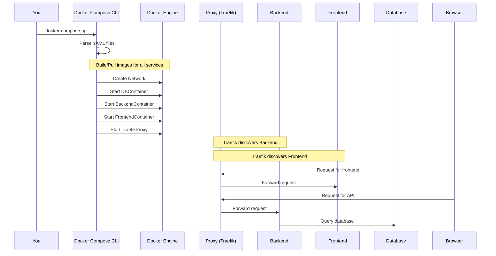

# Chapter 1: Application Containerization & Orchestration (Docker Compose)

Welcome to the `full-stack-fastapi-template` project!
This is the first chapter of our tutorial, where we'll dive into a foundational
concept that makes modern web development much smoother:
**Application Containerization & Orchestration using Docker Compose**.

## What's the Big Deal? The Problem We're Solving

Imagine you're building an amazing new web application.
This app isn't just one single program; it's made of several parts that need to
work together:

1. **Backend:** The "brains" of your application (built with FastAPI in our
   case).
   It handles logic, talks to the database, etc.
2. **Frontend:** What the user sees and interacts with in their web browser
   (built with React/Vite here).
3. **Database:** Where all your application's data is stored (we're using
   PostgreSQL).
4. **Reverse Proxy:** A helper that directs web traffic to the correct backend
   or frontend service (we use Traefik).

Now, imagine trying to get all these pieces running on your computer.
You'd need to install Python for the backend, Node.js for the frontend,
PostgreSQL for the database, and configure them all correctly.
What if your teammate uses a different operating system?
Or what if the server where you deploy your application has slightly different
versions of these tools?
Things can break easily!
This is often called the "it works on my machine" problem.

This is where **Docker** and **Docker Compose** come to the rescue!

## The "Model Kits" Analogy

Think of our application as a complex model, like a spaceship or a detailed city
scene.
Each part of our application (backend, frontend, database) is like a **detailed,
self-contained model kit**.

* **Docker** helps us create these individual model kits.
  Each kit (called a **container**) comes with everything it needs to function:
  the parts (our code), the special glue and paints (dependencies and
  libraries), and its own mini-instruction sheet (how to run it).
  These kits are isolated, meaning what's inside one kit doesn't interfere with
  another.

* **Docker Compose** is like the **master plan or the main instruction booklet**
  that shows how all these individual model kits (containers) fit together to
  form the complete, fully functional application.
  It tells Docker how to assemble and connect the backend kit, the frontend kit,
  and the database kit so they can work in harmony.

This approach ensures that our application runs the same way everywhere:
on your computer, your teammate's computer, and the production server.

## Key Concepts: Docker & Docker Compose

Let's break down the main ideas.

### 1. Docker: Creating the "Model Kits" (Containers)

* **What is a Docker Image?** An image is like a **blueprint or a recipe** for
  creating a container.
  It's a read-only template that contains all the instructions, application
  code, libraries, and dependencies needed to run a piece of our software.
  For example, we'll have an image for our backend and another for our frontend.

* **What is a Docker Container?** A container is a **runnable instance of an
  image**.
  If an image is the recipe, a container is the actual cake baked from that
  recipe.
  It's a lightweight, isolated environment where our application component (like
  the backend) runs.
  It's like a tiny, dedicated computer for that specific part of the app.

* **What is a `Dockerfile`?** A `Dockerfile` is a simple text file that contains
  the **step-by-step instructions** Docker uses to build an image.
  It's like writing down the recipe.

    Let's look at a *simplified* example of what a `Dockerfile` for our Python
    backend might look like (you can find the full version in
    `backend/Dockerfile`):

    ```dockerfile
    # Use an official Python image as a starting point
    FROM python:3.10

    # Set the working directory inside the container
    WORKDIR /app

    # Copy our application's dependency list
    COPY pyproject.toml uv.lock /app/

    # Install the dependencies
    RUN uv sync --frozen

    # Copy our application code into the container
    COPY ./app /app/app

    # Tell Docker what command to run when the container starts
    CMD ["fastapi", "run", "app/main.py"]
    ```

  * `FROM python:3.10`:
    Starts from an official Python 3.10 "base image" (like a pre-made cake
    layer).
  * `WORKDIR /app`:
    Sets the main folder inside our container.
  * `COPY ...`:
    Copies files from our project into the container's image.
  * `RUN ...`:
    Executes commands to build our application (e.g., install libraries).
  * `CMD ...`:
    Specifies the default command to run when a container starts from this image
    (here, it starts our FastAPI backend).

    We have a similar `Dockerfile` in the `frontend/` directory (see
    `frontend/Dockerfile`) to package our React application.

### 2. Docker Compose: The "Master Plan" for Assembly

While Docker helps us package individual parts, **Docker Compose** helps us
define and run *multi-container* applications.
It uses a configuration file, typically named `docker-compose.yml`, to describe
all the services (backend, frontend, database, etc.), how they connect, and any
specific configurations they need.

* **Services:** In Docker Compose, each part of our application (backend,
  frontend, database, proxy) is called a "service."
* **`docker-compose.yml`:** This YAML file is our master plan.
  It tells Docker Compose:
  * Which services to run (e.g., `db`, `backend`, `frontend`).
  * Which Docker image to use for each service (either a pre-built one or one
    built from a `Dockerfile`).
  * How services are connected (networking).
  * Which ports to expose (so we can access them from our browser).
  * Environment variables needed by each service.

Let's look at a very simplified snippet from our `docker-compose.yml` file:

```yaml
# This is a simplified version from docker-compose.yml
services:
  db: # Our PostgreSQL database service
    image: postgres:17 # Use an official PostgreSQL image
    environment: # Settings for the database
      - POSTGRES_USER=${POSTGRES_USER}
      - POSTGRES_PASSWORD=${POSTGRES_PASSWORD}
    # ... other configurations

  backend: # Our FastAPI backend service
    build: ./backend # Build an image from backend/Dockerfile
    ports:
      - "8000:8000" # Map port 8000 on host to 8000 in container
    depends_on: # Make sure 'db' starts before 'backend'
      - db
    # ... other configurations
```

* We define a service named `db`.
  It uses the official `postgres:17` image.
* We define a service named `backend`.
  It will be built using the `Dockerfile` found in the `./backend` directory.
* `ports:
  * "8000:8000"` means that requests to port 8000 on our computer will be
    forwarded to port 8000 inside the `backend` container.
* `depends_on:
  * db` tells Docker Compose to start the `db` service before the `backend`
    service.

Our project also uses a `docker-compose.override.yml` file.
This file is great for development because it allows us to *override* or add to
the configurations in the main `docker-compose.yml` without changing it.
This is typically used for things like:

* Mounting our local code directly into the container for live reloading.
* Exposing different ports for debugging.
* Adding development-specific tools.

For example, in `docker-compose.override.yml`, our `backend` service might have
settings for live code reloading:

```yaml
# Simplified snippet from docker-compose.override.yml
services:
  backend:
    ports:
      - "8000:8000" # Ensure backend is accessible
    command: # Override command for development with live reload
      - fastapi
      - run
      - --reload # Reloads when code changes!
      - "app/main.py"
    develop:
      watch: # Watch for changes in the backend directory
        - path: ./backend
          action: sync # Sync changes into the container
          target: /app
        # ... other watch configurations
```

This setup means that when you change your backend Python code, the server
inside the container will automatically restart, which is super helpful during
development!

## How It All Works Together: Running Your Application

With Docker and Docker Compose set up, running your entire full-stack
application becomes incredibly simple.
You typically navigate to the project's root directory in your terminal and run:

```bash
docker-compose up
```

What happens when you run this command?

1. **Reads Configuration:** Docker Compose reads the `docker-compose.yml` and
   `docker-compose.override.yml` files.
2. **Builds/Pulls Images:**
    * For services with a `build` instruction (like our `backend` and
      `frontend`), Docker Compose tells Docker to build an image using the
      specified `Dockerfile` if it doesn't exist or has changed.
    * For services with an `image` instruction (like `db` using `postgres:17`),
      Docker Compose tells Docker to download (pull) that image from a public
      registry (like Docker Hub) if you don't have it locally.
3. **Creates Network:** Docker Compose sets up a private network so all your
   containers (services) can find and talk to each other.
   For example, the `backend` can talk to the `db` service using its service
   name (`db`) as if it were a hostname.
4. **Starts Containers:** Docker Compose starts a container for each service,
   applying the configurations (ports, volumes, environment variables) you
   defined.
5. **Traefik (The Reverse Proxy):** One of the services we run is `proxy` (using
   Traefik).
   Traefik is a modern reverse proxy that automatically detects our other
   services (like `backend` and `frontend`) and routes incoming web traffic to
   them.
   For local development, it allows you to access your:
    * Backend API at a local address like `http://localhost:8000` or
      `http://api.localhost.tiangolo.com` (if configured).
    * Frontend UI at `http://localhost:5173` or
      `http://dashboard.localhost.tiangolo.com` (if configured).

Here's a simplified diagram showing the flow when you type `docker-compose up`:



This diagram shows you (the developer) telling `Docker Compose CLI` to start
everything.
Docker Compose then instructs the `Docker Engine` to prepare and run containers
for the database, backend, frontend, and the Traefik proxy.
Once running, Traefik handles incoming browser requests, directing them to the
appropriate service (frontend or backend), and services like the backend can
communicate with the database.

The `docker-compose.yml` file also defines services like `prestart` which runs
initial setup tasks like database migrations (which you'll learn about in
[Data Models & Database Schema (`SQLModel` & `Alembic`)](03_data_models___database_schema___sqlmodel_____alembic__.md)).

## Benefits for You, the Developer

* **Consistency:** Your application runs the same way everywhere.
  No more "it works on my machine" headaches!
* **Simplicity:** You can start your entire multi-component application with a
  single command (`docker-compose up`).
* **Isolation:** Each service runs in its own isolated container, so their
  dependencies don't clash.
* **Easy Onboarding:** New team members can get the project running quickly
  without complex setup steps.
* **Production-like Environments:** Develop in an environment that closely
  mirrors how your application will run in production.

## Conclusion

Phew!
That was a lot, but hopefully, you now have a good grasp of why Docker and
Docker Compose are so crucial for this project and modern web development in
general.
They act as the foundation, ensuring all parts of our application – the backend
([API Endpoints & Routing (FastAPI `APIRouter`)](04_api_endpoints___routing__fastapi__apirouter__.md)),
the frontend
([Frontend API Client & State Management](02_frontend_api_client___state_management_.md)),
and the database
([Data Models & Database Schema (`SQLModel` & `Alembic`)](03_data_models___database_schema___sqlmodel_____alembic__.md))
– are neatly packaged and orchestrated.

Think of it as setting up your workshop perfectly before starting to build your
masterpiece.
With Docker Compose, our "workshop" is now ready!

In the next chapter, we'll start looking at one of those "model kits" in more
detail:
the frontend.
We'll explore how it communicates with the backend API and manages its state.

Ready?
Let's move on to
[Chapter 2: Frontend API Client & State Management](02_frontend_api_client___state_management_.md).

---

Generated by
[AI Codebase Knowledge Builder](https://github.com/The-Pocket/Tutorial-Codebase-Knowledge)
