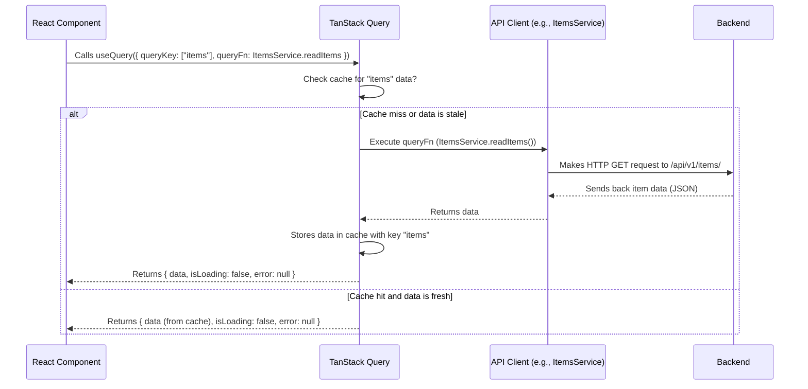

# Chapter 2: Frontend API Client & State Management

Welcome to Chapter 2! In [Chapter 1: Application Containerization & Orchestration (Docker Compose)](01_application_containerization___orchestration__docker_compose__.md), we learned how Docker and Docker Compose help us package and run all the different parts of our application (frontend, backend, database) smoothly. We saw them as "model kits" and a "master plan" to get everything working together.

Now that our application "workshop" is set up and all parts are running, let's zoom in on how our **Frontend** (what the user sees in their browser) talks to our **Backend** (the brains of the operation) and how it keeps track of the data it receives.

## The Challenge: Getting Data and Keeping it Fresh

Imagine our application is a cool new "To-Do List" app. The user opens the webpage (our frontend) and wants to see their to-do items. These items are stored in a database, managed by our backend.

So, the frontend needs to:
1.  **Ask the backend:** "Hey, can you give me the list of to-do items?"
2.  **Receive and display the list:** Show the items to the user.
3.  **Handle changes:** If the user adds a new to-do item, the frontend needs to tell the backend, and then the displayed list should update.
4.  **Manage the "in-between" states:** What happens while the data is loading? What if there's an error?

Doing all this manually can be messy and error-prone. We'd have to write a lot of code just to make a simple request, parse the response, update the screen, show loading messages, handle errors, and decide when to fetch new data.

This is where our "Frontend API Client & State Management" tools come in!

## Our Solution: A "Personal Assistant" and a "Smart Catalogue"

To solve these challenges, this project uses two powerful concepts working together:

1.  **An Auto-Generated API Client:** Think of this as an **efficient personal assistant**. This assistant knows exactly how to talk to our backend. It's created automatically based on the backend's "API contract" (called an OpenAPI specification). This means fewer mistakes and less repetitive coding for us.
2.  **TanStack Query (also known as React Query):** This is like a **smart cataloguing system** for the data our assistant fetches. It remembers what data has been fetched, keeps it up-to-date, and handles all the tricky bits like loading states, error handling, and caching (storing data temporarily so we don't have to ask for it again and again if it hasn't changed).

Let's see how they work!

## Part 1: The Efficient Personal Assistant (Auto-Generated API Client)

Our backend, built with FastAPI, is really good at describing its own API. It can generate a special file (usually `openapi.json`) that lists all its available "endpoints" (like URLs you can call), what kind of data you need to send, and what kind of data you'll get back. This is the **API contract**. You'll learn more about how these backend endpoints are defined in [Chapter 4: API Endpoints & Routing (FastAPI `APIRouter`)](04_api_endpoints___routing__fastapi__apirouter__.md).

Instead of us manually reading this contract and writing functions in our frontend JavaScript/TypeScript to call each backend endpoint, we use a tool called `@hey-api/openapi-ts`. This tool reads the `openapi.json` file and automatically writes TypeScript code for us – our API client!

**How it's set up:**

The configuration for this code generation lives in `frontend/openapi-ts.config.ts`. Here's a simplified peek:

```typescript
// frontend/openapi-ts.config.ts (Simplified)
import { defineConfig } from "@hey-api/openapi-ts";

export default defineConfig({
  client: "legacy/axios",   // Tells it to use 'axios' (a popular library for making HTTP requests)
  input: "./openapi.json",  // The API contract file from our backend
  output: "./src/client",   // Where the generated TypeScript client code will be saved
});
```
*   `client: "legacy/axios"`: We're telling the tool to generate code that uses `axios` to make the actual web requests.
*   `input: "./openapi.json"`: This points to the API definition file. When the backend Docker container starts (as we saw in Chapter 1), it often makes this file available for the frontend to use.
*   `output: "./src/client"`: This is the folder in our frontend code where the generated assistant's code will live.

**What does the generated assistant look like?**

Inside `frontend/src/client/sdk.gen.ts` (the `.gen.ts` means "generated"), you'll find code like this (again, simplified):

```typescript
// frontend/src/client/sdk.gen.ts (Simplified Excerpt)
import type { CancelablePromise } from "./core/CancelablePromise";
import { OpenAPI } from "./core/OpenAPI";
import { request as __request } from "./core/request"; // The actual request maker

// Let's say we have 'Items' in our app (like to-do items)
export class ItemsService {
  /**
   * Read Items - Gets a list of items
   */
  public static readItems(data: { skip?: number; limit?: number }): CancelablePromise<any> {
    return __request(OpenAPI, { // Uses the core request function
      method: "GET",
      url: "/api/v1/items/",    // The backend URL for items
      query: {                  // Optional parameters like for pagination
        skip: data.skip,
        limit: data.limit,
      },
    });
  }

  /**
   * Create Item - Adds a new item
   */
  public static createItem(data: { requestBody: any }): CancelablePromise<any> {
    return __request(OpenAPI, {
      method: "POST",
      url: "/api/v1/items/",
      body: data.requestBody, // The new item data to send
      mediaType: "application/json",
    });
  }
  // ... and methods for updateItem, deleteItem, etc.
}
```
This `ItemsService` class is our "personal assistant" for everything related to items.
*   It has methods like `readItems` and `createItem` that match our backend's API.
*   We don't have to write the `axios` calls, set headers, or construct URLs manually. The assistant does it!
*   It's **type-safe**: TypeScript knows what kind of `data` to send and what the `CancelablePromise<any>` (the response) will look like (we'll see more specific types later). This helps catch errors early.

So, to get items, we'd just call `ItemsService.readItems({})` from our frontend code!

The global settings for this client, like the base URL of our backend API, are configured in `frontend/src/main.tsx`:

```typescript
// frontend/src/main.tsx (Snippet)
import { OpenAPI } from "./client"; // Imports parts of our generated client

// Tells the client where our backend API is running
// VITE_API_URL usually comes from environment variables, set up by Docker Compose
OpenAPI.BASE = import.meta.env.VITE_API_URL; // e.g., "http://localhost:8000"

// Tells the client how to get the authentication token (for protected routes)
OpenAPI.TOKEN = async () => {
  return localStorage.getItem("access_token") || ""; // We'll cover tokens in Chapter 6
};
```
This ensures our assistant knows which "library" (backend server address) to go to and has the "ID card" (auth token) if needed. We'll learn more about user authentication and tokens in [Chapter 6: User Authentication & Authorization (JWT & FastAPI Dependencies)](06_user_authentication___authorization__jwt___fastapi_dependencies__.md).

## Part 2: The Smart Catalogue (TanStack Query)

Our "personal assistant" (the API client) is great at fetching data. But what about:
*   Showing a "Loading..." message while it's fetching?
*   Displaying an error if something goes wrong?
*   Not fetching data again if we just got it a second ago (caching)?
*   Automatically updating the data if it changes on the server?

This is where **TanStack Query** (formerly React Query) comes in. It's our "smart catalogue." It wraps around our assistant's calls and manages all this complexity for us.

**Setting up the Catalogue System:**

First, we need to provide TanStack Query to our entire React application. This is done in `frontend/src/main.tsx`:

```typescript
// frontend/src/main.tsx (Simplified)
import { QueryClient, QueryClientProvider } from "@tanstack/react-query";
import ReactDOM from "react-dom/client";
// ... other imports ...

// Create a new "catalogue brain"
const queryClient = new QueryClient();

ReactDOM.createRoot(document.getElementById("root")!).render(
  // Provide the "catalogue brain" to the whole app
  <QueryClientProvider client={queryClient}>
    {/* ... Rest of our React app ... */}
  </QueryClientProvider>
);
```
Now, any component in our app can use TanStack Query's features.

## Putting It All Together: Fetching and Displaying Items

Let's see how we use our "assistant" (`ItemsService`) and our "smart catalogue" (TanStack Query) to fetch and display a list of items in a React component. This is similar to what you might find in `frontend/src/routes/_layout/items.tsx`.

```typescript
// Simplified React component: ItemsPage.tsx
import { useQuery } from "@tanstack/react-query";
import { ItemsService } from "@/client"; // Our generated "personal assistant"

function ItemsPage() {
  // Use the "smart catalogue" to fetch items
  const { data, isLoading, error } = useQuery({
    queryKey: ["items"], // A unique name for this piece of data in the catalogue
    queryFn: () => ItemsService.readItems({ limit: 10 }), // Tell the assistant to get items
  });

  if (isLoading) {
    return <p>Loading your awesome items...</p>;
  }

  if (error) {
    return <p>Oops! Something went wrong: {error.message}</p>;
  }

  // If data is here, display it!
  // data.data would typically be an array of items from the backend.
  // The actual structure of 'data' depends on what ItemsService.readItems returns.
  return (
    <ul>
      {data?.data?.map((item: any) => ( // data.data is specific to this template's response
        <li key={item.id}>{item.title}</li>
      ))}
    </ul>
  );
}

export default ItemsPage;
```

Let's break down the `useQuery` part:
*   `useQuery`: This is a "hook" (a special function in React) from TanStack Query.
*   `queryKey: ["items"]`: This is like a unique label or ID for this data in our "smart catalogue." TanStack Query uses this to cache the data, refetch it, etc. If you fetch items with different parameters (e.g., for page 2), you'd use a different key like `["items", { page: 2 }]`.
*   `queryFn: () => ItemsService.readItems({ limit: 10 })`: This is the function that actually fetches the data. Here, we're telling our "personal assistant" (`ItemsService`) to call its `readItems` method.
*   `data`: If the fetch is successful, this variable will hold the response from the backend. In this template, the actual array of items is often in `data.data`, and the total count might be in `data.count`. The exact structure of this `data` comes from what your [Data Models & Database Schema (`SQLModel` & `Alembic`)](03_data_models___database_schema___sqlmodel_____alembic__.md) define for your items in the backend.
*   `isLoading`: TanStack Query automatically sets this to `true` while `queryFn` is running and `false` when it's done. This makes it super easy to show loading messages!
*   `error`: If `queryFn` throws an error (e.g., network problem, or the backend signals an error), this variable will contain the error information.

No more manual loading flags or `try...catch` blocks all over your display components for fetching data!

## Under the Hood: A Quick Peek

When `useQuery` is called, here's a simplified flow:



1.  Your **React Component** calls `useQuery`.
2.  **TanStack Query** checks its cache (its "catalogue"). "Do I already have fresh data for `['items']`?"
3.  **If no (or data is old):**
    *   TanStack Query calls the `queryFn` you provided.
    *   Your `queryFn` calls `ItemsService.readItems()`.
    *   The **API Client** (`ItemsService`) constructs the correct HTTP request (using `axios` and the `OpenAPI.BASE` URL) and sends it to the **Backend**.
    *   The Backend processes the request and sends back a response (usually JSON data).
    *   The API Client gives this response back to TanStack Query.
    *   TanStack Query stores this new data in its cache, associated with `["items"]`.
4.  **If yes (data is cached and fresh):**
    *   TanStack Query immediately returns the cached data.
5.  TanStack Query provides `data`, `isLoading`, `error` state to your component, which then re-renders to show the latest information.

The core of the API client that makes the actual HTTP call is in `frontend/src/client/core/request.ts`. You generally don't need to touch this file, but it's good to know it's there, handling things like adding your authentication token to requests.

```typescript
// frontend/src/client/core/request.ts (Conceptual Snippet - actual is more complex)
// This function is called by the generated ItemsService.readItems() etc.
export const request = <T>(config, options): CancelablePromise<T> => {
  return new CancelablePromise(async (resolve, reject, onCancel) => {
    const url = getUrl(config, options); // Builds the full API URL
    const headers = await getHeaders(config, options); // Adds auth token, Content-Type
    // ... uses axios to make the actual HTTP request ...
    // axios.request({ url, method: options.method, headers, data: options.body })
    // ... then resolves or rejects the promise based on the response ...
  });
};
```

## Handling Changes: Creating, Updating, or Deleting Data (Mutations)

What if the user wants to *change* data, like adding a new to-do item? For this, TanStack Query provides `useMutation`.

Let's imagine an `AddItemForm` component:

```typescript
// Simplified AddItemForm.tsx
import { useMutation, useQueryClient } from "@tanstack/react-query";
import { ItemsService, type ItemCreate } from "@/client"; // ItemCreate is a type from generated client

function AddItemForm() {
  const queryClient = useQueryClient(); // Get the "catalogue brain"

  // Setup a mutation for creating an item
  const addItemMutation = useMutation({
    mutationFn: (newItemData: ItemCreate) => // newItemData is what backend expects
      ItemsService.createItem({ requestBody: newItemData }), // Call assistant's createItem
    onSuccess: () => {
      // Important! After successfully adding, tell the catalogue "items" data is old!
      queryClient.invalidateQueries({ queryKey: ["items"] });
      // This will make any component using useQuery({ queryKey: ["items"] }) refetch.
    },
    onError: (error) => {
      alert(`Failed to add item: ${error.message}`);
    },
  });

  const handleSubmit = (event: React.FormEvent) => {
    event.preventDefault();
    const title = /* get title from form input */;
    // Call the mutation
    addItemMutation.mutate({ title, description: "A new task" });
  };

  return (
    <form onSubmit={handleSubmit}>
      {/* ... form inputs ... */}
      <button type="submit" disabled={addItemMutation.isPending}>
        {addItemMutation.isPending ? "Adding..." : "Add Item"}
      </button>
    </form>
  );
}
```

Key parts of `useMutation`:
*   `mutationFn`: The function that performs the action, like `ItemsService.createItem()`.
*   `onSuccess`: This function runs if `mutationFn` succeeds. Here, `queryClient.invalidateQueries({ queryKey: ["items"] })` is crucial. It tells TanStack Query: "Hey, the data associated with the `['items']` key is now out of date because we just added one!" Any component currently displaying that list of items (using `useQuery` with `queryKey: ["items"]`) will automatically refetch its data, showing the newly added item.
*   `onError`: Handles any errors during the mutation.
*   `addItemMutation.mutate({ title: "..." })`: This is how you trigger the mutation.
*   `addItemMutation.isPending`: A handy boolean to know if the mutation is in progress (e.g., to disable the submit button).

You can see a real-world example of `useMutation` and `useQuery` in `frontend/src/hooks/useAuth.ts` which handles user login and fetching user data.

## Conclusion

Phew! We've covered how the frontend gets its job done:
*   It uses an **auto-generated API client** (our "personal assistant") to easily and safely talk to the backend API. This client is created based on the backend's OpenAPI specification, saving us from writing repetitive and error-prone HTTP request code.
*   It uses **TanStack Query** (our "smart catalogue") to manage the data fetched by the assistant. TanStack Query handles loading states, errors, caching, and makes it simple to update data and keep the UI in sync with the server.

This dynamic duo makes developing the frontend much more efficient and results in a smoother experience for the user. You don't have to worry so much about the nitty-gritty of API calls or state synchronization; you can focus on building beautiful and functional user interfaces.

In the next chapter, we'll switch gears and look at the backend. We'll explore how the data itself is defined and how the database schema is managed. Get ready to dive into [Chapter 3: Data Models & Database Schema (`SQLModel` & `Alembic`)](03_data_models___database_schema___sqlmodel_____alembic__.md)!

---

Generated by [AI Codebase Knowledge Builder](https://github.com/The-Pocket/Tutorial-Codebase-Knowledge)