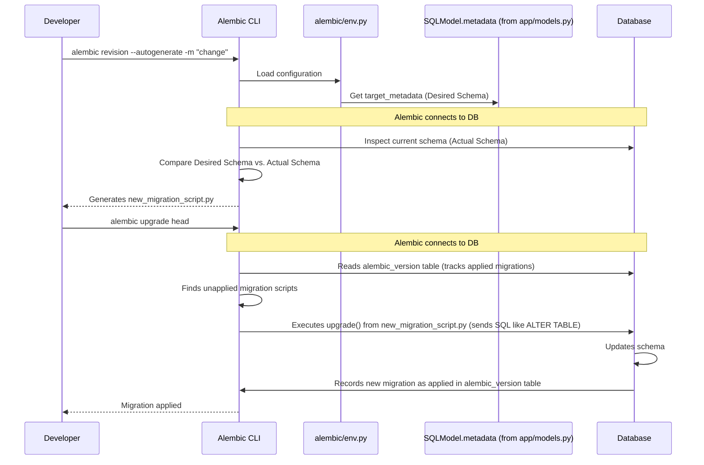

# Chapter 3: Data Models & Database Schema (`SQLModel` & `Alembic`)

Welcome to Chapter 3! In [Chapter 2: Frontend API Client & State Management](02_frontend_api_client___state_management_.md), we saw how our frontend application smartly fetches data from the backend and manages its state. We briefly touched upon how the frontend expects data in a certain format, like a list of items. But how does the backend know what an "item" looks like? How is this data actually stored?

That's what this chapter is all about! We're going to dive into the backend and explore how we define the structure of our application's data and how we manage the database that stores it.

## What's the Big Deal? Planning Your Data's Home

Imagine you're building a house (your application). Before you can start putting furniture (data) in, you need architectural plans (data models) that define the rooms (tables in a database), what goes in each room (columns like `name`, `email`, `price`), and how the rooms are connected (relationships like "a user owns many items").

Our application needs to store information, perhaps about users and the items they create.
*   What information should a "user" have? An email? A password? A name?
*   What about an "item"? A title? A description? Who owns it?
*   How do we tell our database (PostgreSQL in our case) to create tables to hold this information?
*   And what happens if, later, we decide users should also have a `phone_number`? How do we update our database "house" without accidentally knocking down walls or losing existing furniture?

This is where **`SQLModel`** and **`Alembic`** come to the rescue!

*   **`SQLModel`**: Think of `SQLModel` as the **master architect** for your data. It helps you draw detailed blueprints for what your data looks like (e.g., a `User` blueprint, an `Item` blueprint). These blueprints serve two purposes:
    1.  They tell the database how to structure its tables.
    2.  They tell your API (which you'll learn about in [API Endpoints & Routing (FastAPI `APIRouter`)](04_api_endpoints___routing__fastapi__apirouter__.md)) what kind of data to expect in requests and what format to send in responses. This is why our frontend in Chapter 2 knew what `data.data` would contain!

*   **`Alembic`**: Think of `Alembic` as the **expert renovation manager** for your database. As your application grows, your data blueprints (models) will change. Alembic helps you manage these changes to your database structure safely and in a versioned way. It creates "renovation plans" (called migration scripts) that tell the database exactly how to update itself from one version of the blueprints to the next.

## Key Concepts: Blueprints and Renovations

Let's break down these ideas.

### 1. Data Models with `SQLModel`: The Blueprints

A **data model** is a Python class that defines the structure and properties of a piece of data. For example, we'll have a model for `User` and a model for `Item`.

`SQLModel` is a library that cleverly combines the features of **Pydantic** (for data validation and serialization – making sure data is correct and can be easily sent/received by APIs) and **SQLAlchemy** (a powerful tool for talking to databases, known as an ORM).

*   **ORM (Object-Relational Mapper):** This is a fancy term for a tool that lets you work with your database using familiar Python objects and classes instead of writing raw SQL queries all the time. `SQLModel` helps map your Python `User` class to a `user` table in your database.

Here's a peek at how simple `SQLModel` makes defining data. This is a simplified version of what you'd find in `backend/app/models.py`:

```python
# backend/app/models.py (Simplified User model)
import uuid # For generating unique IDs
from sqlmodel import SQLModel, Field, Relationship

class UserBase(SQLModel): # Base properties, not a table itself
    email: str = Field(unique=True, index=True)
    full_name: str | None = None

class User(UserBase, table=True): # This IS a database table blueprint
    id: uuid.UUID = Field(default_factory=uuid.uuid4, primary_key=True)
    hashed_password: str
    # Defines a "one-to-many" relationship: one User can have many Items
    items: list["Item"] = Relationship(back_populates="owner")
```
*   `UserBase` defines common fields.
*   `User` inherits from `UserBase` and adds `table=True` to tell `SQLModel` that this class corresponds to a database table named `user`.
*   `Field(...)` describes each piece of information (like a column in the database table):
    *   `id: uuid.UUID`: A unique identifier for each user, generated automatically.
    *   `email: str`: The user's email, which must be unique.
    *   `hashed_password: str`: Where the user's (securely hashed) password will be stored.
*   `Relationship(...)`: This tells `SQLModel` how `User`s are related to `Item`s (which we'll define next). One user can own many items.

Now for an `Item` model:
```python
# backend/app/models.py (Simplified Item model)
# ... (User model definition from above) ...

class ItemBase(SQLModel):
    title: str = Field(min_length=1)
    description: str | None = None

class Item(ItemBase, table=True): # This IS a database table blueprint
    id: uuid.UUID = Field(default_factory=uuid.uuid4, primary_key=True)
    owner_id: uuid.UUID = Field(foreign_key="user.id", ondelete="CASCADE")
    # Defines a "many-to-one" relationship: an Item belongs to one User
    owner: User | None = Relationship(back_populates="items")
```
*   `Item` also has `table=True`, so it maps to an `item` table.
*   `owner_id: uuid.UUID = Field(foreign_key="user.id")`: This is crucial! It links an item to a user. The `foreign_key="user.id"` part tells the database that `owner_id` must match an `id` from the `user` table. `ondelete="CASCADE"` means if a user is deleted, their items are also deleted.
*   The `owner: User | None = Relationship(...)` allows us to easily access the `User` object that owns an `Item` from our Python code (e.g., `my_item.owner.email`).

These `SQLModel` classes are not just for the database. They are also used by FastAPI to:
*   **Validate incoming API data:** If someone tries to create an item without a `title`, FastAPI (using `SQLModel`'s Pydantic powers) will automatically reject it.
*   **Serialize outgoing API data:** When your API sends a list of items, `SQLModel` ensures it's formatted correctly as JSON for the frontend. This is what makes `data.data` in [Chapter 2: Frontend API Client & State Management](02_frontend_api_client___state_management_.md) work!

### 2. Database Schema: The Actual Structure in the Database

When we apply these `SQLModel` blueprints to our PostgreSQL database, they create a **database schema**. This schema is the actual layout of tables, columns, data types (like `TEXT`, `INTEGER`, `BOOLEAN`, `UUID`), primary keys, foreign keys, and indexes within the database.

Initially, your database is empty. `SQLModel` tells `Alembic` (our renovation manager) what the "desired" schema should be.

### 3. Database Migrations with `Alembic`: The Renovation Manager

Your application will evolve. You might need to:
*   Add a new field to the `User` model (e.g., `date_of_birth`).
*   Change a field's type.
*   Add a new table entirely.

If you just change your `SQLModel` Python code, the database doesn't automatically know about these changes. If you directly modify the database, your Python code might break. This can be a mess, especially if you have existing data!

**Alembic** solves this by managing **database migrations**. A migration is a script that contains instructions (Python code using Alembic's `op` functions) to alter the database schema from one version to another.

*   **Version Control for Your Database:** Think of migrations like commits in Git, but for your database structure. Each migration has a unique ID and represents a specific set of changes.
*   **Autogeneration:** Alembic can often compare your `SQLModel` definitions with the current state of your database and *automatically generate* most of the migration script for you!
*   **Repeatable and Reversible (Downgrade):** Migration scripts usually have an `upgrade()` function (to apply changes) and a `downgrade()` function (to undo changes), making it safe to move your database schema forward or backward.

## How It All Works Together: Defining and Evolving Your Data Structure

Let's walk through how you'd define a model and then change it.

### Step 1: Defining Your Initial Models

You start by writing your `SQLModel` classes in `backend/app/models.py`, just like the `User` and `Item` examples we saw.

```python
# backend/app/models.py (Initial state, example)
import uuid
from sqlmodel import SQLModel, Field, Relationship # Make sure to import SQLModel and Field!

# ... (User model as defined before) ...

class ItemBase(SQLModel):
    title: str = Field(min_length=1)
    description: str | None = None

class Item(ItemBase, table=True):
    id: uuid.UUID = Field(default_factory=uuid.uuid4, primary_key=True)
    # title and description are inherited from ItemBase
    owner_id: uuid.UUID = Field(foreign_key="user.id", ondelete="CASCADE")
    owner: User | None = Relationship(back_populates="items")
```
This code clearly defines what an `Item` is and its connection to a `User`.

### Step 2: Generating the First Migration

When your project is first set up, or after you've defined your initial models, you need to tell Alembic to create the database tables.

1.  **Ensure Alembic knows your models:** The file `backend/app/alembic/env.py` is configured to look at your `SQLModel` definitions. Specifically, this line is key:
    ```python
    # backend/app/alembic/env.py (Snippet)
    from app.models import SQLModel  # Imports your SQLModel base
    # ... other alembic setup ...
    target_metadata = SQLModel.metadata # This tells Alembic about your tables
    ```
    `SQLModel.metadata` collects all the table definitions from your models (those with `table=True`).

2.  **Generate the migration script:** You run a command (usually inside your backend Docker container, which you learned about in [Chapter 1: Application Containerization & Orchestration (Docker Compose)](01_application_containerization___orchestration__docker_compose__.md)):
    ```bash
    # Inside the backend container (e.g., via `docker-compose exec backend bash`)
    alembic revision -m "initialize_models" --autogenerate
    ```
    *   `alembic revision`: Tells Alembic to create a new migration script.
    *   `-m "initialize_models"`: Gives a descriptive message for this migration.
    *   `--autogenerate`: Tells Alembic to compare `SQLModel.metadata` with the (currently empty or different) database and generate the changes.

    Alembic will create a new Python file in `backend/app/alembic/versions/`, something like `e2412789c190_initialize_models.py`. This file contains the instructions to create your tables:

    ```python
    # backend/app/alembic/versions/e2412789c190_initialize_models.py (Simplified)
    """Initialize models

    Revision ID: e2412789c190
    Revises: # This would be empty for the first migration
    Create Date: 2023-11-24 22:55:43.195942
    """
    from alembic import op
    import sqlalchemy as sa
    import sqlmodel # Important for SQLModel types

    # revision identifiers, used by Alembic.
    revision = "e2412789c190"
    down_revision = None # No previous revision for the first one
    # ...

    def upgrade():
        op.create_table( # Alembic command to create a table
            "user",
            sa.Column("id", sqlmodel.sql.sqltypes.GUID(), nullable=False), # Using GUID for UUID
            sa.Column("email", sqlmodel.sql.sqltypes.AutoString(), nullable=False),
            # ... other columns for user ...
            sa.PrimaryKeyConstraint("id"),
        )
        # ... op.create_table for "item" and any indexes ...
        # Example for item table:
        op.create_table(
            "item",
            sa.Column("id", sqlmodel.sql.sqltypes.GUID(), nullable=False),
            sa.Column("title", sqlmodel.sql.sqltypes.AutoString(), nullable=False),
            sa.Column("owner_id", sqlmodel.sql.sqltypes.GUID(), nullable=False),
            sa.ForeignKeyConstraint(["owner_id"], ["user.id"],), # Defines relationship
            sa.PrimaryKeyConstraint("id")
        )

    def downgrade(): # How to undo this migration
        op.drop_table("item")
        op.drop_table("user")
    ```
    This script uses `op.create_table()`, `op.add_column()`, etc., to define the database operations.

### Step 3: Applying the Migration

To actually create these tables in your database, you run:
```bash
# Inside the backend container
alembic upgrade head
```
*   `alembic upgrade`: Tells Alembic to apply migrations.
*   `head`: Tells it to apply all migrations up to the latest one.

This command executes the `upgrade()` function in all unapplied migration scripts. Your database tables are now created!

This `alembic upgrade head` command is typically run automatically when your application starts, thanks to the `prestart.sh` script configured in your `docker-compose.yml`. You saw this "prestart" concept in [Chapter 1: Application Containerization & Orchestration (Docker Compose)](01_application_containerization___orchestration__docker_compose__.md).

### Step 4: Evolving Your Models (Making a Change)

Now, let's say you want to add a `is_completed` field to your `Item` model to track if a to-do item is done.

1.  **Modify `backend/app/models.py`:**
    ```python
    # backend/app/models.py (After adding is_completed to Item)
    # ... (User model and ItemBase definition) ...

    class Item(ItemBase, table=True):
        id: uuid.UUID = Field(default_factory=uuid.uuid4, primary_key=True)
        owner_id: uuid.UUID = Field(foreign_key="user.id", ondelete="CASCADE")
        owner: User | None = Relationship(back_populates="items")
        is_completed: bool = Field(default=False) # Our new field!
    ```

2.  **Generate a new migration script:**
    ```bash
    # Inside the backend container
    alembic revision -m "add_is_completed_to_item" --autogenerate
    ```
    Alembic will detect the new `is_completed` field and create a new script in `backend/app/alembic/versions/`, say `XXXX_add_is_completed_to_item.py`:

    ```python
    # backend/app/alembic/versions/XXXX_add_is_completed_to_item.py (Simplified)
    """add is_completed to item

    Revision ID: XXXX
    Revises: e2412789c190 # Points to the previous migration
    Create Date: ...
    """
    from alembic import op
    import sqlalchemy as sa
    import sqlmodel

    revision = 'XXXX'
    down_revision = 'e2412789c190' # The ID of the "initialize_models" migration
    # ...

    def upgrade():
        # Add the new column to the 'item' table
        op.add_column('item', sa.Column('is_completed', sa.Boolean(), nullable=True))
        # Set a default value for existing rows (important!)
        op.execute('UPDATE item SET is_completed = false WHERE is_completed IS NULL')
        # Now make it not nullable if that's desired
        op.alter_column('item', 'is_completed', nullable=False)


    def downgrade():
        op.drop_column('item', 'is_completed') # How to remove the column
    ```
    Notice how `down_revision` now points to our initial migration.

3.  **Apply the new migration:**
    ```bash
    # Inside the backend container
    alembic upgrade head
    ```
    This runs the `upgrade()` function in `XXXX_add_is_completed_to_item.py`, adding the new `is_completed` column to your `item` table in the database. Existing items will have `is_completed` set to `false`.

You can see an example of a more complex migration in `backend/app/alembic/versions/d98dd8ec85a3_edit_replace_id_integers_in_all_models_.py`, which changes the `id` columns from integers to UUIDs. This involved adding new columns, populating them, dropping old columns, and renaming. Alembic helps manage such complex changes step-by-step.

## Under the Hood: How Alembic Knows What to Do



1.  **Model Definition (`SQLModel`):** When you define your classes in `backend/app/models.py` with `SQLModel` and `table=True`, `SQLModel` (using SQLAlchemy's core components) builds an internal representation of your desired database structure. This is stored in `SQLModel.metadata`.
2.  **Alembic Configuration (`env.py`):** The file `backend/app/alembic/env.py` tells Alembic where to find this "desired state":
    ```python
    # backend/app/alembic/env.py (Key line)
    from app.models import SQLModel
    # ...
    target_metadata = SQLModel.metadata
    ```
    It also contains the database connection URL, often pulled from your application settings (see [Backend Configuration (`Settings` class)](07_backend_configuration___settings__class__.md)). This is specified in the `get_url()` function within `env.py`, which uses `settings.SQLALCHEMY_DATABASE_URI`.
3.  **Autogenerate (`alembic revision --autogenerate`):**
    *   Alembic uses the database URL to connect to your actual database.
    *   It inspects the current schema of your database (what tables and columns actually exist).
    *   It compares this "current state" with the `target_metadata` (your "desired state" from `SQLModel`).
    *   It generates a migration script containing `op.` commands (like `op.add_column`, `op.create_table`) that represent the differences.
4.  **Apply Migration (`alembic upgrade head`):**
    *   Alembic connects to the database.
    *   It checks a special table it maintains (usually called `alembic_version`) to see which migrations have already been applied.
    *   For any unapplied migrations, it executes their `upgrade()` functions in order.
    *   These `op.` commands are translated by SQLAlchemy into actual SQL statements (`CREATE TABLE ...`, `ALTER TABLE ... ADD COLUMN ...`) which are then run against your database.
    *   After a migration's `upgrade()` function successfully completes, Alembic updates the `alembic_version` table.

The database connection itself is typically established using an "engine," as seen in `backend/app/core/db.py`:
```python
# backend/app/core/db.py (Snippet)
from sqlmodel import create_engine
from app.core.config import settings

engine = create_engine(str(settings.SQLALCHEMY_DATABASE_URI))
```
Alembic uses a similar mechanism configured in `alembic.ini` and `env.py` to connect to and interact with your database.

## Benefits for You

*   **Clear Data Definitions:** Your `SQLModel` classes are a single source of truth for your data structures, easily understandable by Python developers.
*   **Automatic Data Validation & Serialization:** Your API gets data validation and request/response formatting "for free" thanks to `SQLModel`'s Pydantic integration.
*   **Safe Database Changes:** Alembic provides a structured and version-controlled way to evolve your database schema, reducing the risk of errors.
*   **Team Collaboration:** Everyone on the team can keep their local database schemas in sync by running `alembic upgrade head`.
*   **Reproducibility:** You can recreate your database schema from scratch on any environment by applying all migrations.

## Conclusion

You've now seen how `SQLModel` acts as the architect, designing the blueprints for your data, and how `Alembic` acts as the careful renovation manager, ensuring your database structure can evolve safely and systematically. These tools are fundamental to building a robust backend that can handle data effectively.

These data models are the "nouns" of your application. In the next chapter, we'll look at the "verbs" – how we create API endpoints that allow the outside world (like our frontend) to interact with these data models.

Get ready to explore [Chapter 4: API Endpoints & Routing (FastAPI `APIRouter`)](04_api_endpoints___routing__fastapi__apirouter__.md)!

---

Generated by [AI Codebase Knowledge Builder](https://github.com/The-Pocket/Tutorial-Codebase-Knowledge)