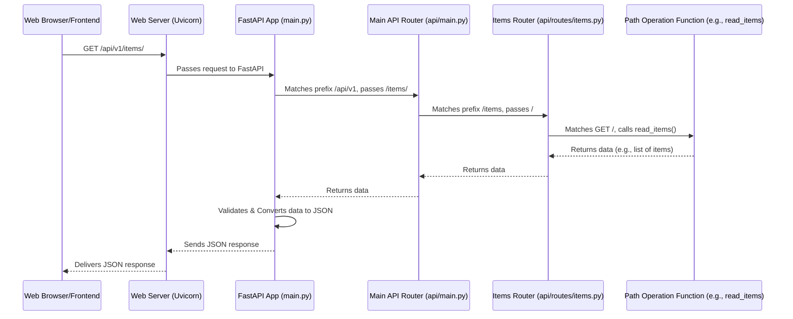

# Chapter 4: API Endpoints & Routing (FastAPI `APIRouter`)

Welcome to Chapter 4! In [Chapter 3: Data Models & Database Schema (`SQLModel` & `Alembic`)](03_data_models___database_schema___sqlmodel_____alembic__.md), we learned how to design the "blueprints" for our data (like `User` and `Item` models) and manage our database structure. We now have a way to define and store information.

But how does our frontend application (or any other client) actually *interact* with this data? How can it request a list of items, or tell the backend to create a new one? This is where API endpoints and routing come into play!

## The "Front Desk" of Your Application: What Problem Are We Solving?

Imagine our application is like a large, busy office building. This building has many departments (like "Users Department," "Items Department"), and each department offers various services (like "Get User Details," "List All Items," "Create New Item").

If someone wants to use a service, they can't just wander around the building. They need:
1.  A clear **address** for the department and the specific service they want.
2.  A specific **action** they want to perform (e.g., "I want to *get* information" or "I want to *submit* new information").

Our backend API needs a similar system. The frontend needs to know specific URLs (addresses) to send requests to, and what kind of requests (actions) it can make to those URLs to get, create, update, or delete data.

This is where **FastAPI's `APIRouter`** helps us organize these "services" (called **endpoints**) in a clean and manageable way. It's like setting up a well-organized reception desk and directory for our office building, ensuring every request gets to the right place efficiently.

## Key Concepts: Doors, Addresses, and Services

Let's break down the main ideas:

1.  **API Endpoint:**
    *   **Analogy:** A specific "office door" in our building that provides a particular service.
    *   **Technical:** A specific URL path (e.g., `/users/`, `/items/{item_id}`) combined with an HTTP method (like GET, POST) that, when accessed, triggers a specific function in our backend to perform an action. For example, `GET /items/` might fetch all items.

2.  **HTTP Methods (The Actions):**
    These are standard "verbs" that tell the server what kind of operation the client wants to perform on a resource. The most common ones are:
    *   **GET:** Retrieve data (e.g., get a list of items, get details of one item). Like asking for a brochure.
    *   **POST:** Create new data (e.g., add a new item to the list). Like submitting a new application form.
    *   **PUT:** Update existing data (e.g., modify an existing item). Like submitting an updated form.
    *   **DELETE:** Remove data (e.g., delete an item). Like shredding a document.

3.  **Routing:**
    *   **Analogy:** The "signage and hallways" in our office building that direct visitors from the main entrance to the correct department and office door.
    *   **Technical:** The process of matching an incoming HTTP request (URL path + HTTP method) to the specific backend function that should handle it.

4.  **FastAPI `APIRouter` (The Department Manager):**
    *   **Analogy:** Each department in our office building (e.g., "Items Department," "Users Department").
    *   **Technical:** A way to group related API endpoints together in FastAPI. Each `APIRouter` can handle a specific resource (like "users" or "items") and define all the available operations (GET, POST, PUT, DELETE) for that resource. This keeps our API code organized, especially as the application grows.

5.  **Request/Response Data Structures:**
    *   When the frontend sends a request (e.g., to create a new item with POST), it often sends data in the request body.
    *   When our backend responds, it sends data back.
    *   These data structures are defined using our `SQLModel` classes from [Chapter 3: Data Models & Database Schema (`SQLModel` & `Alembic`)](03_data_models___database_schema___sqlmodel_____alembic__.md). This ensures data consistency and validation.

## Setting Up a "Department": Creating Endpoints with `APIRouter`

Let's see how we can create a "department" for managing "Items" in our application. We'll look at simplified versions of code found in `backend/app/api/routes/items.py`.

### 1. Creating an `APIRouter` for Items

First, we create an instance of `APIRouter`. This will be our "Items Department."

```python
# backend/app/api/routes/items.py (Simplified)
from fastapi import APIRouter
# Import our SQLModel classes for data shapes
from app.models import ItemCreate, ItemPublic, ItemsPublic 

# Create a router for items
router = APIRouter(
    prefix="/items",  # All paths in this router will start with /items
    tags=["items"],   # Groups these endpoints in the API docs
)
```
*   `APIRouter()`: Creates a new router object.
*   `prefix="/items"`: This is super useful! It means any endpoint defined in *this* router will automatically have its URL prefixed with `/items`. So, if we define an endpoint at `/`, its full path will be `/items/`.
*   `tags=["items"]`: This helps organize our API documentation (which FastAPI generates automatically!). All endpoints in this router will be grouped under the "items" tag.

### 2. Defining an Endpoint to Get All Items (GET)

Now, let's add an "office door" (endpoint) to get a list of all items. This uses the `GET` HTTP method.

```python
# backend/app/api/routes/items.py (Simplified - continued)
# ... (router definition from above) ...

@router.get("/", response_model=ItemsPublic) # GET request to /items/
def read_items() -> ItemsPublic:
    """
    Retrieve a list of items. (Simplified for example)
    """
    # In a real app, this would fetch from the database (see Chapter 5)
    fake_items_db = [
        {"id": "1", "title": "First Item", "owner_id": "user1"},
        {"id": "2", "title": "Second Item", "owner_id": "user1"},
    ]
    # We'll learn how to populate 'count' properly later
    return ItemsPublic(data=fake_items_db, count=len(fake_items_db))
```
*   `@router.get("/")`: This is a "decorator." It tells FastAPI that the function `read_items` below it should handle `GET` requests to the path `/` (which becomes `/items/` because of our router's prefix).
*   `response_model=ItemsPublic`: This tells FastAPI that the response from this endpoint will be structured according to our `ItemsPublic` SQLModel. `ItemsPublic` (defined in `app/models.py`) likely contains a list of `ItemPublic` objects and a `count`. FastAPI will automatically convert our Python return value into JSON matching this model.
*   `def read_items() -> ItemsPublic:`: This is our function. The `-> ItemsPublic` is a type hint, reinforcing the response structure.
*   **What happens:** When a client sends a `GET` request to `/api/v1/items/` (the `/api/v1` prefix is added later by the main app), FastAPI routes it to this `read_items` function. The function prepares some data and returns it. FastAPI then validates it against `ItemsPublic` and sends it as a JSON response.

### 3. Defining an Endpoint to Create an Item (POST)

Next, let's create an endpoint to add a new item. This uses the `POST` HTTP method.

```python
# backend/app/api/routes/items.py (Simplified - continued)
# ... (other code) ...
import uuid # For generating IDs

@router.post("/", response_model=ItemPublic, status_code=201) # POST to /items/
def create_item(*, item_in: ItemCreate) -> ItemPublic:
    """
    Create a new item. (Simplified)
    """
    print(f"Received new item: {item_in.title}")
    # In a real app, this would save to DB (see Chapter 5)
    # and get a real ID. For now, fake it.
    new_item_data = item_in.model_dump() # Convert ItemCreate to dict
    new_item_data["id"] = str(uuid.uuid4()) # Give it a new ID
    new_item_data["owner_id"] = "current_user_id_placeholder" # Placeholder owner

    # Create an ItemPublic model from the data to return
    created_item = ItemPublic(**new_item_data)
    return created_item
```
*   `@router.post("/")`: This function handles `POST` requests to `/items/`.
*   `response_model=ItemPublic`: The response will be a single `ItemPublic` object.
*   `status_code=201`: Sets the HTTP status code for a successful creation to `201 Created`.
*   `item_in: ItemCreate`: This is powerful! FastAPI will expect the `POST` request to have a JSON body that matches the structure of our `ItemCreate` SQLModel (defined in `app/models.py`). FastAPI automatically validates the incoming data. If it's not valid (e.g., missing a required `title`), it sends back an error.
*   **What happens:** If the frontend sends a `POST` request to `/api/v1/items/` with JSON data like `{"title": "My New Task", "description": "Do it soon!"}`, FastAPI validates this data against `ItemCreate`. If valid, it calls `create_item`, passing the data as the `item_in` argument. Our function then (conceptually) saves it and returns the created item's details.

### 4. Defining an Endpoint to Get a Specific Item (GET with Path Parameter)

What if we want to get just *one* specific item by its ID?

```python
# backend/app/api/routes/items.py (Simplified - continued)
# ... (other code) ...

@router.get("/{item_id}", response_model=ItemPublic) # GET to /items/{some_id_value}
def read_item(*, item_id: uuid.UUID) -> ItemPublic:
    """
    Get a specific item by its ID. (Simplified)
    """
    # In a real app, search DB for item_id
    if str(item_id) == "1": # Example
        return ItemPublic(id="1", title="First Item", owner_id="user1")
    # Handle item not found (FastAPI's HTTPException is great for this)
    from fastapi import HTTPException
    raise HTTPException(status_code=404, detail="Item not found")
```
*   `@router.get("/{item_id}")`: The `{item_id}` part is a **path parameter**. It means this endpoint expects a value in that part of the URL.
*   `item_id: uuid.UUID`: The function argument `item_id` will receive the value from the URL. FastAPI also validates that it's a valid `uuid.UUID`.
*   **What happens:** A `GET` request to `/api/v1/items/some-uuid-value` would call `read_item(item_id="some-uuid-value")`.

You can see more complete examples for `PUT` (update) and `DELETE` in the actual `backend/app/api/routes/items.py` file. They follow similar patterns, often using path parameters for the item ID and request bodies (for `PUT`) defined by `SQLModel`s like `ItemUpdate`.

## Connecting the "Departments" to the Main "Building Entrance"

We've defined our "Items Department" (`items.router`). Now we need to connect it to the main application.

This happens in two stages:

1.  **Main API Router (`backend/app/api/main.py`):**
    This file gathers all the different "department" routers.
    ```python
    # backend/app/api/main.py (Simplified)
    from fastapi import APIRouter
    from app.api.routes import items, users, login # Import other routers

    api_router = APIRouter() # A "master" router for the whole API

    # "Plug in" the items department
    api_router.include_router(items.router)
    # "Plug in" the users department
    api_router.include_router(users.router)
    # "Plug in" the login department
    api_router.include_router(login.router)
    # ... and so on for other routers ...
    ```
    *   `api_router.include_router(items.router)`: This tells the `api_router` to include all the endpoints from our `items.router`. Since `items.router` has a prefix of `/items`, its endpoints will now be available under that path relative to `api_router`.

2.  **Main FastAPI App (`backend/app/main.py`):**
    This is the entry point of our FastAPI application. It includes the `api_router`.
    ```python
    # backend/app/main.py (Simplified)
    from fastapi import FastAPI
    from app.api.main import api_router # Our master API router
    from app.core.config import settings # For API prefix

    app = FastAPI(title=settings.PROJECT_NAME)

    # Include the master API router, usually with a global prefix like /api/v1
    app.include_router(api_router, prefix=settings.API_V1_STR)
    ```
    *   `app = FastAPI(...)`: Creates the main FastAPI application instance.
    *   `app.include_router(api_router, prefix=settings.API_V1_STR)`: This plugs our `api_router` (which contains `items.router`, `users.router`, etc.) into the main app. The `prefix=settings.API_V1_STR` (which is usually `/api/v1`) means all our API endpoints will now be accessible under `/api/v1`.

So, an endpoint defined as `@router.get("/")` in `items.py` (which has `prefix="/items"`) and included in `api_router` which is then included in `app` with `prefix="/api/v1"`, will have the final URL: `/api/v1/items/`.

## Under the Hood: How FastAPI Handles a Request

When a request like `GET /api/v1/items/` hits your server:



1.  **Request Arrives:** The web server (Uvicorn, typically used with FastAPI) receives the HTTP request.
2.  **FastAPI Takes Over:** Uvicorn passes the request to your main FastAPI `app` instance.
3.  **Routing Begins:**
    *   FastAPI (using Starlette's routing capabilities) starts matching the request's path (`/api/v1/items/`) against the registered routers.
    *   It first matches the `/api/v1` prefix of the `api_router` in `app/main.py`.
    *   The remaining path (`/items/`) is then passed to `api_router` in `app/api/main.py`.
    *   `api_router` matches the `/items` prefix of the `items.router` (from `app/api/routes/items.py`).
    *   The remaining path (`/`) is passed to `items.router`.
4.  **Path Operation Match:** `items.router` looks for a function decorated with `@router.get("/")`. It finds our `read_items` function.
5.  **Function Execution:** FastAPI calls `read_items()`.
    *   If there were path parameters (e.g., `/items/{item_id}`), FastAPI would extract them, convert to the specified type (e.g., `uuid.UUID`), and pass them as arguments.
    *   If it were a `POST` or `PUT` request with a body, FastAPI would parse the JSON body, validate it against the specified `SQLModel` (e.g., `ItemCreate`), and pass it as an argument.
6.  **Response Processing:**
    *   The `read_items` function returns its result (e.g., an `ItemsPublic` object).
    *   FastAPI takes this Python object, validates it against the `response_model` (if defined), and converts it into a JSON string.
7.  **Response Sent:** FastAPI sends the HTTP response (with the correct status code and JSON body) back to the client.

This whole process is incredibly fast and efficient, thanks to FastAPI's design.

## Benefits of Using `APIRouter`

*   **Organization:** Keeps your API endpoints neatly grouped by resource (users, items, etc.), making your codebase easier to navigate and understand. Imagine an office building where each department is clearly marked!
*   **Maintainability:** When you need to change something related to "items," you know to look in `items.py`.
*   **Reusability:** Routers can potentially be reused or adapted more easily.
*   **Automatic API Documentation:** FastAPI uses these routers and path operations (along with `SQLModel`s and type hints) to automatically generate interactive API documentation (usually at `/docs` and `/redoc`). This documentation is a massive help for frontend developers (as seen in [Chapter 2: Frontend API Client & State Management](02_frontend_api_client___state_management_.md) where the OpenAPI spec is used to generate a client) and anyone else consuming your API.

## Conclusion

You've now learned how FastAPI uses `APIRouter` to define clear "addresses" (URL paths) and "services" (HTTP methods) for your application's data and functionality. This creates a well-structured and well-documented API that's easy for clients like your frontend to interact with. We've seen how to define `GET` and `POST` endpoints, use path parameters, and specify request and response data shapes using `SQLModel`.

These endpoints are the "doors" to your application's data. But what happens inside the "office" once a request comes through? How do we actually fetch data from the database or save new data? That's what we'll explore in the next chapter.

Get ready to dive into the actual data handling logic in [Chapter 5: Database Operations (CRUD functions & `Session`)](05_database_operations__crud_functions____session___.md)!

---

Generated by [AI Codebase Knowledge Builder](https://github.com/The-Pocket/Tutorial-Codebase-Knowledge)