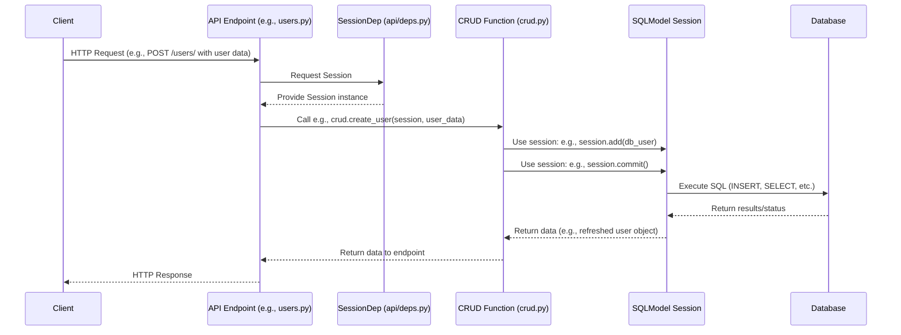

# Chapter 5: Database Operations (CRUD functions & `Session`)

Welcome to Chapter 5! In [Chapter 4: API Endpoints & Routing (FastAPI `APIRouter`)](04_api_endpoints___routing__fastapi__apirouter__.md), we saw how to define "doors" (API endpoints) into our application, allowing the frontend or other clients to send requests like "give me all items" or "create this new item."

But what happens once a request like "create this new item" comes through the door? The API endpoint function needs to actually *do* something with the data – save it to our database! If every API endpoint function tried to talk to the database directly in its own way, our code could get very messy, repetitive, and hard to test.

Imagine our application is a busy restaurant. The waiters (API endpoints) take orders from customers. If every waiter also had to run to the kitchen, figure out how to find ingredients, cook the dish, and then update inventory, it would be chaos! Instead, there's a **kitchen staff** (our CRUD functions) that specializes in preparing food (handling data) based on standardized order slips (requests with data models). The waiters just pass the order to the kitchen.

This chapter is about that "kitchen staff" – the **CRUD functions** – and the main tool they use to interact with the database: the **`Session`**.

## Key Concepts: The Kitchen and its Tools

1.  **CRUD Operations:**
    This is an acronym for the fundamental operations you can perform on data:
    *   **C**reate: Add new data (e.g., a new user, a new item).
    *   **R**ead: Retrieve existing data (e.g., get a user's details, list all items).
    *   **U**pdate: Modify existing data (e.g., change a user's email, mark an item as completed).
    *   **D**elete: Remove data (e.g., delete a user account, remove an item).

2.  **The Database `Session` (Your Workbench and Tools):**
    *   **Analogy:** Think of the `Session` as a temporary, dedicated **workbench** or a **conversation** you have with the database. When you want to make changes or query data, you first start a session. You tell the session what you want to do (e.g., "add this new item," "find me that user"), and then, when you're ready, you tell the session to "make it so" (`commit`) or "never mind" (`rollback`).
    *   **Technical:** A `Session` (from SQLAlchemy, which `SQLModel` uses under the hood) manages the connection to the database for a set of operations. It tracks changes to objects and translates your Python commands into SQL that the database understands.
    *   **`SessionDep` (Getting the Workbench):** In our project, API endpoints get a `Session` through a FastAPI "dependency" called `SessionDep`. This dependency automatically provides a fresh `Session` for each incoming request and ensures it's properly closed afterwards. This is like borrowing a clean set of tools from a shared workshop for each task.

3.  **CRUD Functions (The Specialized Kitchen Staff):**
    *   **Analogy:** These are like specialized chefs in our kitchen. One chef might be an expert at "creating users," another at "fetching items."
    *   **Technical:** These are Python functions, typically grouped in `backend/app/crud.py`, that encapsulate the logic for a specific CRUD operation on a specific data model. For example, `crud.create_user(...)` or `crud.get_item_by_id(...)`.
    *   **Why use them?**
        *   **Cleaner API Endpoints:** Keeps database logic out of your API route handlers, making them shorter and focused on request/response handling.
        *   **Reusability:** If multiple API endpoints need to perform the same database operation, they can all call the same CRUD function.
        *   **Easier Testing:** You can test CRUD functions independently of the API layer.
        *   **Centralized Logic:** If you need to change how items are fetched, you change it in one place (the CRUD function).

## The Database `Session`: Your Workbench for Data Tasks

Before we dive into dedicated CRUD functions, let's see how we get and use the `Session`.

### How Do We Get a `Session`? Meet `SessionDep`

In `backend/app/api/deps.py`, there's a handy dependency set up for us:

```python
# backend/app/api/deps.py (Simplified get_db function)
from sqlmodel import Session
from app.core.db import engine # Our database engine from Chapter 3

def get_db() -> Generator[Session, None, None]:
    with Session(engine) as session: # Create a new session
        yield session # Provide it to the endpoint
    # Session is automatically closed when 'with' block exits
```
*   `Session(engine)` creates a new conversation with our database.
*   `yield session` "provides" this session to the part of our code that asked for it (our API endpoint).
*   The `with ... as session:` part ensures that the session is always closed properly after the request is finished, even if errors occur.

This `get_db` function is wrapped in `SessionDep = Annotated[Session, Depends(get_db)]`. So, when an API endpoint function has an argument like `session: SessionDep`, FastAPI automatically calls `get_db` and passes the resulting `Session` object to the endpoint.

### Basic Database Tasks with the `Session` (Directly in API Endpoints)

Sometimes, for very simple database operations that are tightly coupled to a specific endpoint, the logic might be handled directly within the API endpoint function using the injected `session`. The `backend/app/api/routes/items.py` file in this template often shows this pattern.

**Example 1: Creating an Item directly in the API endpoint**

Let's look at a simplified version of how an item might be created in `backend/app/api/routes/items.py`:

```python
# backend/app/api/routes/items.py (Simplified create_item endpoint)
from app.models import Item, ItemCreate, ItemPublic # SQLModels from Chapter 3
from app.api.deps import SessionDep, CurrentUser # SessionDep!

@router.post("/", response_model=ItemPublic)
def create_item_endpoint(
    *, session: SessionDep, current_user: CurrentUser, item_in: ItemCreate
) -> Item:
    # 1. Create a SQLModel Item instance from incoming data
    db_item = Item.model_validate(item_in, update={"owner_id": current_user.id})

    # 2. Add it to the session's "to-do" list
    session.add(db_item)
    # 3. Tell the session to save all pending changes to the database
    session.commit()
    # 4. Refresh the db_item object with any new data from DB (like auto-ID)
    session.refresh(db_item)
    return db_item
```
1.  `Item.model_validate(...)`: We create an `Item` model instance (our database-aware object from [Chapter 3: Data Models & Database Schema (`SQLModel` & `Alembic`)](03_data_models___database_schema___sqlmodel_____alembic__.md)) from the request data (`item_in`).
2.  `session.add(db_item)`: This tells the session, "I want to save this new item." It doesn't hit the database yet; it just stages the change.
3.  `session.commit()`: This is the command that actually executes the SQL `INSERT` statement and saves the item to the database.
4.  `session.refresh(db_item)`: After committing, if the database generated an ID for the item or set any default values, this updates our `db_item` Python object with that information.

**Example 2: Reading Items directly in the API endpoint**

Here's a simplified way `read_items` from `backend/app/api/routes/items.py` might fetch items:

```python
# backend/app/api/routes/items.py (Simplified read_items endpoint)
from sqlmodel import select

@router.get("/", response_model=ItemsPublic)
def read_items_endpoint(
    session: SessionDep, current_user: CurrentUser, skip: int = 0, limit: int = 100
) -> ItemsPublic:
    # 1. Create a query to select items
    statement = (
        select(Item)
        .where(Item.owner_id == current_user.id) # Only user's own items
        .offset(skip).limit(limit)
    )
    # 2. Execute the query using the session
    items = session.exec(statement).all()
    # ... (get total count, then return ItemsPublic(data=items, count=...))
    return ItemsPublic(data=items, count=len(items)) # Simplified count
```
1.  `select(Item)`: We use SQLModel's `select` function to build a query statement: "I want to select `Item` objects." We can add conditions like `where`, `offset` (for pagination), and `limit`.
2.  `session.exec(statement).all()`: The session executes this statement against the database, and `.all()` fetches all matching rows, converting them into `Item` model instances.

This direct use of the `session` in API handlers is fine for simple cases. But as logic gets more complex or needs to be reused, we turn to our "specialized kitchen staff."

## The "Specialized Workshop": CRUD Functions in `crud.py`

The file `backend/app/crud.py` is our "specialized workshop" or "kitchen." It contains functions dedicated to performing specific database operations. These functions take the `session` as an argument, along with any necessary data (often as `SQLModel` objects).

**Why use CRUD functions?**
*   **Separation of Concerns:** API endpoints focus on HTTP stuff (request validation, response formatting, authentication checks), while CRUD functions focus *only* on database interactions.
*   **Reusability:** If you need to create a user from an admin panel *and* from a public signup form, both can call `crud.create_user()`.
*   **Testability:** CRUD functions can be tested in isolation, without needing to simulate HTTP requests.
*   **Clarity:** Makes your codebase easier to understand.

Let's look at how the `users` endpoints (`backend/app/api/routes/users.py`) use functions from `crud.py`.

### Example 1: Creating a User (API Endpoint + CRUD Function)

**The API Endpoint (`backend/app/api/routes/users.py`):**
This endpoint receives the request to create a new user. After some initial checks, it delegates the actual database work to a CRUD function.

```python
# backend/app/api/routes/users.py (Simplified create_user endpoint)
from app import crud # Import our CRUD module
from app.models import UserCreate, UserPublic
# ... other imports

@router.post("/", response_model=UserPublic)
def create_user_endpoint(*, session: SessionDep, user_in: UserCreate) -> UserPublic:
    # Check if user already exists (could also use a crud function for this)
    existing_user = crud.get_user_by_email(session=session, email=user_in.email)
    if existing_user:
        raise HTTPException(status_code=400, detail="Email already registered.")

    # Delegate user creation to the CRUD function
    user = crud.create_user(session=session, user_create=user_in)
    # ... (code to send a welcome email might go here) ...
    return user
```
Notice how clean this endpoint is. It calls `crud.get_user_by_email` and `crud.create_user`, passing the `session` and the input data `user_in`.

**The CRUD Function (`backend/app/crud.py`):**
This is the "chef" that knows exactly how to create a user.

```python
# backend/app/crud.py (Simplified create_user function)
from sqlmodel import Session
from app.models import User, UserCreate
from app.core.security import get_password_hash # For hashing passwords

def create_user(*, session: Session, user_create: UserCreate) -> User:
    # Prepare the User object, including hashing the password
    hashed_password = get_password_hash(user_create.password)
    db_obj = User.model_validate(user_create, update={"hashed_password": hashed_password})

    session.add(db_obj)
    session.commit()
    session.refresh(db_obj)
    return db_obj
```
*   This function takes the `session` and a `UserCreate` model.
*   It performs logic specific to user creation, like hashing the password.
*   Then, it uses the familiar `session.add()`, `session.commit()`, and `session.refresh()` to save the new user to the database.

### Example 2: Getting a User by Email (API Endpoint + CRUD Function)

The `create_user_endpoint` above already used `crud.get_user_by_email`. Let's look at that CRUD function.

**The CRUD Function (`backend/app/crud.py`):**

```python
# backend/app/crud.py (Simplified get_user_by_email)
from sqlmodel import Session, select
from app.models import User

def get_user_by_email(*, session: Session, email: str) -> User | None:
    statement = select(User).where(User.email == email)
    # .first() gets one result or None if not found
    session_user = session.exec(statement).first()
    return session_user
```
*   This function builds a `select` statement to find a `User` with the given `email`.
*   `session.exec(statement).first()` executes the query and returns the first matching user, or `None` if no user has that email.

## How It Works: Request to Database and Back

Let's visualize the flow when an API endpoint uses a CRUD function:



1.  A **Client** (e.g., your frontend) sends an HTTP request to an **API Endpoint**.
2.  FastAPI routes the request to the correct endpoint function (e.g., `create_user_endpoint` in `users.py`).
3.  Because the endpoint function has `session: SessionDep` as an argument, **`SessionDep`** (via `get_db`) is invoked. It creates a database **`Session`** and "injects" it into the endpoint function.
4.  The API endpoint function calls a **CRUD function** (e.g., `crud.create_user`), passing the active `session` and the necessary data (like `user_in`).
5.  The CRUD function uses the passed `session` object and its methods (`add()`, `commit()`, `exec()`, etc.) to interact with the database. These methods use `SQLModel`'s capabilities, which in turn use SQLAlchemy to generate and execute SQL.
6.  The **Database** processes the SQL and returns results or confirms changes.
7.  The `session` (and SQLAlchemy) translates these database results back into Python objects (your `SQLModel` instances).
8.  The CRUD function returns these objects to the API endpoint.
9.  The API endpoint constructs the HTTP response (often converting the Python objects to JSON) and sends it back to the client.

The `Session` is the crucial link, managing the actual database "conversation." CRUD functions organize *how* we talk to the session for specific, reusable tasks.

## Benefits Review

Using this pattern of `Session` and separate CRUD functions gives us:
*   **Clear Separation:** API handlers deal with HTTP, CRUD functions deal with DB logic.
*   **DRY (Don't Repeat Yourself):** Common database operations are written once in `crud.py`.
*   **Testability:** CRUD functions can be unit-tested more easily.
*   **Maintainability:** Database logic is centralized, making updates simpler.

It's like having a well-organized kitchen where waiters focus on customers and chefs focus on cooking, leading to a more efficient and reliable restaurant!

## Conclusion

You've now learned about the critical role of the database `Session` as your main tool for interacting with the database, and how CRUD functions in `crud.py` help organize these interactions into a clean, reusable, and testable "workshop." You've seen how to add, read, commit, and refresh data using `Session` methods, both directly in API endpoints for simple tasks and encapsulated within CRUD functions for more complex or reusable logic.

This ability to manage data is fundamental. But what about ensuring only the *right* people can access or modify certain data? That's where authentication and authorization come in.

In the next chapter, we'll explore how our application handles [Chapter 6: User Authentication & Authorization (JWT & FastAPI Dependencies)](06_user_authentication___authorization__jwt___fastapi_dependencies__.md).

---

Generated by [AI Codebase Knowledge Builder](https://github.com/The-Pocket/Tutorial-Codebase-Knowledge)