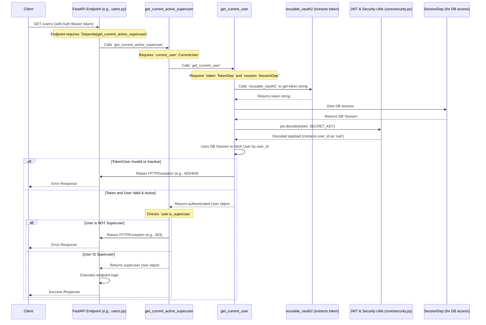

# Chapter 6: User Authentication & Authorization (JWT & FastAPI Dependencies)

Welcome to Chapter 6! In [Chapter 5: Database Operations (CRUD functions & `Session`)](05_database_operations__crud_functions____session___.md), we learned how to create, read, update, and delete data in our database using `Session` and well-organized CRUD functions. Now that we can manage data, a very important question arises: How do we control *who* can access or modify this data? How do we make sure users can only see their own information, and how do we create special admin-only sections?

This is where User Authentication and Authorization come into play!

## The "Exclusive Club" Problem: Why Do We Need This?

Imagine our application is like an exclusive club:
1.  **Membership Desk (Login):** To enter, you first need to prove you're a member. This is **Authentication**.
2.  **Membership Card (JWT):** Once verified, you get a special membership card. This card is your **JSON Web Token (JWT)**. It's proof that you're allowed in.
3.  **Checking Cards at Different Doors (Protected Endpoints):** Inside the club, there are different areas. Some are for all members, others are VIP-only. At each door, a guard checks your membership card. This is **Authorization**.
4.  **VIP Access (Superuser):** The VIP card (or a special mark on your regular card) grants access to exclusive areas. This is like having **superuser** privileges.

Without this system:
*   Anyone could see anyone else's private data (e.g., your personal to-do items).
*   Anyone could perform actions reserved for administrators (e.g., deleting other users).

This chapter will show you how `full-stack-fastapi-template` uses JWTs and FastAPI's clever "Dependency Injection" system to manage this "exclusive club" security.

## Key Concepts: Our Security System Explained

Let's break down the components of our security system:

### 1. Authentication (The "Gatekeeper" at the Main Entrance)

*   **What is it?** Authentication is the process of verifying *who you are*. It's like the gatekeeper at the club entrance asking for your name and checking it against the member list, usually by asking for a secret password.
*   **How it works here:** In our app, a user typically provides their email and password. The backend checks if these credentials match a user stored in the database (using logic from `crud.authenticate` we saw in [Chapter 5: Database Operations (CRUD functions & `Session`)](05_database_operations__crud_functions____session___.md)).

### 2. JSON Web Tokens (JWT) (The "Membership Card")

*   **What is it?** A JWT is like a digitally signed, tamper-proof membership card. Once the "gatekeeper" (authentication) verifies you, they issue you this "card."
*   **How it works here:**
    *   It's a compact string of characters that contains some information (called "claims") in JSON format, like your user ID and when the card expires.
    *   It's "signed" by the server using a secret key. This means if anyone tries to tamper with the information on the card, the signature becomes invalid, and the server will know.
    *   The client (e.g., your web browser's frontend) receives this JWT and stores it. For every subsequent request to a protected part of the club (a protected API endpoint), the client sends this JWT along, usually in an "Authorization" header.

### 3. Authorization (The "Guards at Various Doors")

*   **What is it?** Once you're authenticated (you have your JWT membership card), authorization is about checking *what you are allowed to do or access*.
*   **How it works here:**
    *   When you try to access an API endpoint (a "door" in the club), a "guard" (a piece of code in FastAPI) checks your JWT.
    *   It first validates the JWT (is it a real card? has it expired?).
    *   Then, it might check for specific permissions:
        *   "Is this user just a regular member, trying to access their own data?" (e.g., fetching `/api/v1/items/me`)
        *   "Does this user have a VIP stamp, trying to access an admin area?" (e.g., accessing `/api/v1/users/` to manage all users, requiring superuser status).

### 4. FastAPI Dependencies (`Depends`) (The "Smart Guards")

*   **What is it?** FastAPI has a very powerful system called Dependency Injection, used via `Depends`. Think of these as "smart guards" that can perform complex checks automatically before allowing access to an endpoint.
*   **How it works here:** We define functions (dependencies) that:
    1.  Automatically extract the JWT from the request.
    2.  Verify the JWT.
    3.  Load the corresponding user from the database.
    4.  Optionally, check if the user has specific roles (like `is_superuser`).
    If any of these checks fail (e.g., missing token, invalid token, user not found, insufficient permissions), the "smart guard" automatically stops the request and sends an appropriate error response (like "401 Unauthorized" or "403 Forbidden"). The actual API endpoint code doesn't even run!

## Putting It All Together: Securing Our App Step-by-Step

Let's see this system in action.

### Step 1: Logging In (Getting Your "Membership Card" - JWT)

The user needs to log in to get their JWT. This happens at an API endpoint like `/login/access-token`, defined in `backend/app/api/routes/login.py`.

```python
# backend/app/api/routes/login.py (Simplified login_access_token)
from fastapi import APIRouter, Depends, HTTPException
from fastapi.security import OAuth2PasswordRequestForm # Standard form for username/password
from app import crud
from app.api.deps import SessionDep # To talk to the database
from app.core import security # For creating JWTs
from app.models import Token # Our SQLModel for the response

router = APIRouter()

@router.post("/login/access-token") # Our login "door"
def login_access_token(
    session: SessionDep, form_data: OAuth2PasswordRequestForm = Depends()
) -> Token:
    user = crud.authenticate( # From Chapter 5: checks email/password in DB
        session=session, email=form_data.username, password=form_data.password
    )
    if not user or not user.is_active: # Not a member or inactive
        raise HTTPException(status_code=400, detail="Incorrect email or password")

    # User is valid! Create a JWT "membership card"
    access_token = security.create_access_token(subject=user.id)
    return Token(access_token=access_token, token_type="bearer")
```
*   The user sends their email (as `form_data.username`) and `password` to this endpoint.
*   `crud.authenticate` (from [Chapter 5: Database Operations (CRUD functions & `Session`)](05_database_operations__crud_functions____session___.md)) verifies these against the database.
*   If valid, `security.create_access_token(subject=user.id)` generates a JWT. The `user.id` is stored inside the JWT as the "subject" (`sub`).
*   The endpoint returns this `access_token` (the JWT) to the client. The client (e.g., the frontend from [Chapter 2: Frontend API Client & State Management
](02_frontend_api_client___state_management_.md)) will store this token.

**Output (what the client receives):**
```json
{
  "access_token": "eyJhbGciOiJIUzI1NiIsInR5cCI6IkpXVCJ9.eyJleHAiOjE2Nz...", // A long JWT string
  "token_type": "bearer"
}
```

### Step 2: Using the "Membership Card" (Accessing Protected Endpoints)

Now, when the client wants to access a protected area, it sends the JWT in the `Authorization` header:
`Authorization: Bearer <the_long_jwt_string_from_login>`

FastAPI needs "smart guards" (dependencies) to handle this. These are mainly defined in `backend/app/api/deps.py`.

**The Key "Smart Guard": `get_current_user`**

```python
# backend/app/api/deps.py (Simplified get_current_user)
import jwt
from fastapi import Depends, HTTPException, status
from fastapi.security import OAuth2PasswordBearer # Extracts token from header
# ... other imports from context ...
from app.core import security, config # For SECRET_KEY and ALGORITHM
from app.models import TokenPayload, User

# This tells FastAPI where to find the token and how it's formatted
reusable_oauth2 = OAuth2PasswordBearer(
    tokenUrl=f"{config.settings.API_V1_STR}/login/access-token"
)
# TokenDep is a shortcut to get the raw token string
TokenDep = Annotated[str, Depends(reusable_oauth2)]

def get_current_user(session: SessionDep, token: TokenDep) -> User:
    try:
        payload_data = jwt.decode( # Try to decode the "membership card"
            token, config.settings.SECRET_KEY, algorithms=[security.ALGORITHM]
        )
        # TokenPayload is an SQLModel from models.py to validate JWT contents
        token_payload = TokenPayload(**payload_data)
    except (jwt.InvalidTokenError, ValidationError): # Card is fake or damaged!
        raise HTTPException(
            status_code=status.HTTP_403_FORBIDDEN, detail="Could not validate credentials"
        )
    # Card is valid, get user ID from payload.sub
    user = session.get(User, token_payload.sub) # Fetch user from DB
    if not user or not user.is_active: # User not found or inactive
        raise HTTPException(status_code=404, detail="User not found or inactive")
    return user # Return the authenticated User object!

# CurrentUser is a handy shortcut for API endpoints
CurrentUser = Annotated[User, Depends(get_current_user)]
```
*   `reusable_oauth2`: An object from FastAPI that knows how to find the "Bearer token" in the `Authorization` header.
*   `TokenDep`: A dependency that simply provides the raw token string extracted by `reusable_oauth2`.
*   `get_current_user`: This is the main "smart guard."
    1.  It receives the `token` string (thanks to `TokenDep`).
    2.  It tries to `jwt.decode` the token using the `SECRET_KEY` (more on this in [Chapter 7: Backend Configuration (`Settings` class)](07_backend_configuration___settings__class__.md)). This verifies the token's signature and checks if it has expired.
    3.  If decoding is successful, it extracts the user ID from the token's `sub` (subject) field.
    4.  It uses the `session` (from `SessionDep`) to fetch the `User` from the database using this ID.
    5.  It checks if the user exists and is active.
    6.  If all checks pass, it returns the `User` object. Otherwise, it raises an `HTTPException`, and FastAPI handles the error response.
*   `CurrentUser`: A type hint we can use in our API endpoints. If an endpoint function has an argument `current_user: CurrentUser`, FastAPI will automatically run `get_current_user` and provide the result.

**Example: An Endpoint Guarded by `CurrentUser`**
Let's say we have an endpoint to get the current user's own profile information.

```python
# backend/app/api/routes/users.py (Example: /users/me endpoint)
from app.api.deps import CurrentUser # Our "smart guard"
from app.models import UserPublic     # SQLModel for the response

@router.get("/me", response_model=UserPublic)
def read_user_me(current_user: CurrentUser) -> UserPublic:
    # If we reach here, get_current_user was successful!
    # current_user is the fully authenticated User object from the DB.
    return current_user # FastAPI will convert this to JSON
```
*   If a client calls `/api/v1/users/me` without a valid JWT, `get_current_user` will raise an error, and `read_user_me` won't even execute.
*   If a valid JWT is provided, `current_user` will be the authenticated `User` object, and the endpoint can safely return their data.

### Step 3: VIP Access (Superuser-Only Endpoints)

Some "doors" are only for VIPs (superusers). We need another "smart guard" that checks for this special status *after* confirming the user is authenticated.

**The "VIP Guard": `get_current_active_superuser`**

```python
# backend/app/api/deps.py (Simplified get_current_active_superuser)
# ... (CurrentUser is defined above) ...

def get_current_active_superuser(current_user: CurrentUser) -> User:
    # current_user is already authenticated and active thanks to CurrentUser dependency
    if not current_user.is_superuser:
        raise HTTPException( # Not a VIP!
            status_code=403, detail="The user doesn't have enough privileges"
        )
    return current_user # It's a VIP!
```
*   This dependency takes a `CurrentUser` (so we know they are already authenticated).
*   It then checks the `is_superuser` attribute of the `User` object (this attribute comes from our `User` model defined in [Chapter 3: Data Models & Database Schema (`SQLModel` & `Alembic`)](03_data_models___database_schema___sqlmodel_____alembic__.md)).
*   If not a superuser, it raises a "403 Forbidden" error.

**Example: A Superuser-Only Endpoint**
Imagine an endpoint to list all users in the system, which should only be accessible to superusers.

```python
# backend/app/api/routes/users.py (Example: GET /users/ endpoint)
from app.api.deps import SessionDep, get_current_active_superuser
from app.models import UsersPublic, User # User model for Depends

@router.get("/", response_model=UsersPublic)
def read_users(
    session: SessionDep,
    # This guard ensures only an active superuser can access this
    current_admin: User = Depends(get_current_active_superuser),
    skip: int = 0,
    limit: int = 100
) -> UsersPublic:
    # If we reach here, current_admin is an authenticated superuser.
    # Now we can safely list all users from the database.
    # users = crud.get_users(session=session, skip=skip, limit=limit) # Simplified
    # return UsersPublic(data=users, count=len(users))
    return UsersPublic(data=[], count=0) # Placeholder
```
*   By using `Depends(get_current_active_superuser)`, this endpoint is now doubly protected:
    1.  The user must be logged in (checked by `CurrentUser` inside `get_current_active_superuser`).
    2.  The logged-in user must have `is_superuser = True`.

## Under the Hood: How FastAPI's `Depends` Works Its Magic

When a request comes in for an endpoint that uses these dependencies, FastAPI does a lot for you:



1.  **Request Arrives:** Client sends a request to a protected endpoint (e.g., `GET /users/`) with an `Authorization: Bearer <token>` header.
2.  **Dependency Chain:** FastAPI sees the endpoint needs `Depends(get_current_active_superuser)`.
    *   `get_current_active_superuser` needs `current_user: CurrentUser`.
    *   `CurrentUser` (which is `Depends(get_current_user)`) needs `session: SessionDep` and `token: TokenDep`.
    *   `TokenDep` (which is `Depends(reusable_oauth2)`) needs the request.
3.  **Token Extraction:** `reusable_oauth2` extracts the `token` string from the request's `Authorization` header.
4.  **Session Provided:** `SessionDep` provides a database `session`.
5.  **User Authentication (`get_current_user`):**
    *   The `token` string and `session` are passed to `get_current_user`.
    *   `jwt.decode()` (from `backend/app/core/security.py`) is called with the token and `settings.SECRET_KEY`. This verifies the signature and expiration. The key part of the token's content is usually `{"sub": "user_id_here"}`. This is defined by `TokenPayload` in `backend/app/models.py`.
    *   The `user_id` is extracted from `payload.sub`.
    *   The `User` is fetched from the database using `session.get(User, user_id)`.
    *   User activity is checked.
    *   If any step fails, an `HTTPException` is raised, and the process stops. Otherwise, the `User` object is returned.
6.  **Superuser Authorization (`get_current_active_superuser`):**
    *   The authenticated `User` object is passed to `get_current_active_superuser`.
    *   It checks `if not current_user.is_superuser:`.
    *   If true, an `HTTPException (403 Forbidden)` is raised. Otherwise, the `User` object (now confirmed as a superuser) is returned.
7.  **Endpoint Execution:** If all dependencies pass, the `User` object (who is an active superuser) is passed as `current_admin` to the `read_users` endpoint function, and its logic finally runs.

The actual JWT creation happens in `backend/app/core/security.py`:
```python
# backend/app/core/security.py (Simplified create_access_token)
from datetime import datetime, timedelta, timezone
import jwt
from app.core.config import settings # Access to SECRET_KEY

ALGORITHM = "HS256"

def create_access_token(subject: str | Any, expires_delta: timedelta | None = None) -> str:
    if expires_delta:
        expire = datetime.now(timezone.utc) + expires_delta
    else: # Default expiration time
        expire = datetime.now(timezone.utc) + timedelta(
            minutes=settings.ACCESS_TOKEN_EXPIRE_MINUTES
        )
    to_encode = {"exp": expire, "sub": str(subject)} # "sub" is standard for subject (user ID)
    encoded_jwt = jwt.encode(to_encode, settings.SECRET_KEY, algorithm=ALGORITHM)
    return encoded_jwt
```
This function takes the user's ID (`subject`), sets an expiration time, and then uses `jwt.encode` with your application's `SECRET_KEY` and the `HS256` algorithm to create the token string. This `SECRET_KEY` is super important and must be kept secret! You'll learn more about it in [Chapter 7: Backend Configuration (`Settings` class)](07_backend_configuration___settings__class__.md).

## Conclusion

Phew! That was a deep dive into security. You've learned how `full-stack-fastapi-template` implements:
*   **Authentication** (logging in users) using email/password.
*   Issuing **JSON Web Tokens (JWTs)** as "membership cards."
*   **Authorization** (controlling access) through FastAPI's powerful **Dependency Injection** system (`Depends`).
*   Creating "smart guards" like `get_current_user` and `get_current_active_superuser` to protect your API endpoints defined in [Chapter 4: API Endpoints & Routing (FastAPI `APIRouter`)](04_api_endpoints___routing__fastapi__apirouter__.md).

This multi-level security system – the gatekeeper (login), the access badge (JWT), and the smart guards at various doors (dependencies) – is fundamental to building secure web applications.

Many of these security mechanisms, especially JWT handling, rely on configurations like a secret key and token expiration times. How are these managed? We'll explore that in the next chapter!

Ready to learn about how the backend gets its settings? Let's move on to [Chapter 7: Backend Configuration (`Settings` class)](07_backend_configuration___settings__class__.md).

---

Generated by [AI Codebase Knowledge Builder](https://github.com/The-Pocket/Tutorial-Codebase-Knowledge)