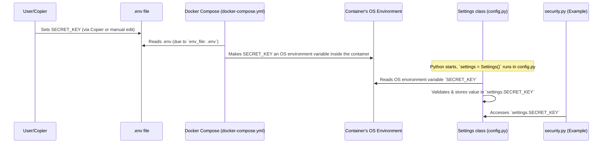

# Chapter 7: Backend Configuration (`Settings` class)

Welcome to Chapter 7! In [Chapter 6: User Authentication & Authorization (JWT & FastAPI Dependencies)](06_user_authentication___authorization__jwt___fastapi_dependencies__.md), we delved into how our application secures its "doors" using JWTs and FastAPI dependencies, ensuring only the right users can access specific information. You might have noticed that concepts like the `SECRET_KEY` for signing JWTs or `ACCESS_TOKEN_EXPIRE_MINUTES` are crucial for security. But where do these values come from? How does our application know them?

That's precisely what this chapter is about: the **Backend Configuration (`Settings` class)**.

## The "Robot's Control Panel": Why Do We Need This?

Imagine our backend application is a sophisticated robot. This robot needs various settings to operate correctly:
*   The **address of its charging station** (our database connection details).
*   The **secret password for its main control panel** (security keys like the `SECRET_KEY`).
*   The **email address it uses to send notifications** (email server settings).

If you hardcoded these settings directly into the robot's "brain" (your Python code), what happens when you want to use a copy of the robot in a different house (e.g., moving from your development machine to a production server)? You'd have to perform "brain surgery" on the robot to change these hardcoded values. This is risky, error-prone, and becomes a nightmare if you have multiple robots (development, staging, production environments) each needing slightly different settings.

The `Settings` class in `full-stack-fastapi-template` acts as the **central control panel** for our backend "robot." It's where all its operational switches and dials are defined. Crucially, it doesn't store these settings directly in the code. Instead, it reads them from the **environment** where the application is running. This often means reading from a special file (like `.env`) or from variables set by our container system ([Chapter 1: Application Containerization & Orchestration (Docker Compose)](01_application_containerization___orchestration__docker_compose__.md)).

This makes it super easy to adjust settings for different environments without touching a single line of Python code for the application's core logic!

## Key Concepts: The Switches and Dials

Let's break down how this "control panel" works:

1.  **Environment Variables:**
    *   **Analogy:** Think of these as labels on the outside of our robot that we can set. For example, a label `POSTGRES_PASSWORD` could have the value `supersecretpassword`.
    *   **Technical:** Environment variables are dynamic values that can affect the way running processes will behave on a computer. They are part of the "environment" in which a process runs. Our Docker containers get these variables set for them.

2.  **The `.env` File (Your Local Settings Sheet):**
    *   **Analogy:** For your personal robot at home (your development setup), you might have a handy sheet of paper listing all its preferred settings.
    *   **Technical:** A file, typically named `.env` and located in the root of your project, where you can list environment variables and their values, like `SECRET_KEY="my_local_secret"`. This file is very convenient for local development. **Important:** This file usually contains sensitive information and should *not* be committed to version control systems like Git. The template includes `.env` in its `.gitignore` file for this reason.

3.  **Pydantic's `BaseSettings` (The Smart Interpreter):**
    *   **Analogy:** Imagine a smart interpreter built into the robot's control panel. You tell it which settings the robot needs (e.g., "database password," "secret key"), and the interpreter automatically looks for the labels (environment variables) or checks your settings sheet (`.env` file) to find their values. It also makes sure the values are in the correct format (e.g., a number for a port, a valid email for an email setting).
    *   **Technical:** Our `Settings` class (found in `backend/app/core/config.py`) is built using Pydantic's `BaseSettings`. This powerful tool automatically reads values from environment variables (and the `.env` file), converts them to the correct Python types (like `str`, `int`, `HttpUrl`), validates them, and allows us to set default values.

## How It Works: Setting Up Your Backend's Control Panel

Let's see how these pieces fit together.

### 1. Defining the Settings (`backend/app/core/config.py`)

The heart of our configuration is the `Settings` class. Here's a simplified look:

```python
# backend/app/core/config.py (Simplified)
import secrets
from pydantic import PostgresDsn, EmailStr, computed_field
from pydantic_settings import BaseSettings, SettingsConfigDict

class Settings(BaseSettings):
    # Tell Pydantic to look for a .env file in the parent directory
    model_config = SettingsConfigDict(env_file="../.env", extra="ignore")

    PROJECT_NAME: str
    SECRET_KEY: str = secrets.token_urlsafe(32) # A secure default

    # Database connection details
    POSTGRES_SERVER: str
    POSTGRES_USER: str
    POSTGRES_PASSWORD: str
    POSTGRES_DB: str

    # A "computed field" combines other settings
    @computed_field
    @property
    def SQLALCHEMY_DATABASE_URI(self) -> PostgresDsn:
        return f"postgresql://{self.POSTGRES_USER}:{self.POSTGRES_PASSWORD}@{self.POSTGRES_SERVER}/{self.POSTGRES_DB}"

    # Email settings (optional)
    SMTP_HOST: str | None = None
    EMAILS_FROM_EMAIL: EmailStr | None = None
    # ... more settings ...

# Create an instance of Settings. This line does the magic!
# Pydantic reads environment variables and .env file NOW.
settings = Settings()
```
*   `class Settings(BaseSettings):`: We define our configuration class, inheriting from Pydantic's `BaseSettings`.
*   `model_config = SettingsConfigDict(env_file="../.env", ...)`: This tells Pydantic to:
    *   Look for a file named `.env` in the directory *above* the `backend/app/core/` directory (i.e., in your project root).
    *   `extra="ignore"`: If there are environment variables not defined in the `Settings` class, Pydantic will ignore them.
*   Fields like `PROJECT_NAME: str`, `POSTGRES_USER: str`: These declare the settings our application needs. Pydantic will expect environment variables with these names (e.g., `PROJECT_NAME`, `POSTGRES_USER`).
*   `SECRET_KEY: str = secrets.token_urlsafe(32)`: This provides a cryptographically secure default value for `SECRET_KEY` if it's not found in the environment or `.env` file.
*   `@computed_field`: The `SQLALCHEMY_DATABASE_URI` is not set directly via an environment variable. Instead, it's automatically constructed from the individual PostgreSQL settings (`POSTGRES_USER`, `POSTGRES_PASSWORD`, etc.). Pydantic's `PostgresDsn` type also validates that the resulting string is a valid PostgreSQL connection URL.
*   `settings = Settings()`: This single line is crucial! When Python executes this line, Pydantic springs into action:
    1.  It reads all the fields defined in the `Settings` class.
    2.  It looks for corresponding environment variables (case-insensitive).
    3.  It loads values from the specified `.env` file.
    4.  It validates the types (e.g., ensuring `POSTGRES_PORT` is an integer).
    5.  It populates the `settings` object with these values.

The actual `config.py` file in the template also includes helpful validations, like ensuring that default "changethis" passwords are changed for production environments (using `@model_validator`).

### 2. The `.env` File (Example)

This file lives in your project's root directory (one level above `backend/`). It's where you'll typically store your local development settings.

```dotenv
# .env (Example - place this in your project root)
PROJECT_NAME="My Dev App"

# Database
POSTGRES_SERVER=localhost
POSTGRES_USER=myuser
POSTGRES_PASSWORD=localpassword
POSTGRES_DB=myapp_dev
POSTGRES_PORT=5432 # Pydantic handles converting this to int

# Security
SECRET_KEY="a_very_long_and_super_secret_key_for_dev_only"
ACCESS_TOKEN_EXPIRE_MINUTES=60

# Email (can be left blank if not using email features locally)
SMTP_HOST=
SMTP_USER=
SMTP_PASSWORD=
EMAILS_FROM_EMAIL=
```
When your backend application starts (and `settings = Settings()` is run), Pydantic will read this file if it exists in the location specified by `env_file`.

### 3. Using the Settings in Your Application

Once the `settings` object is created in `config.py`, other parts of your application can simply import and use it:

**Example: Database Setup (`backend/app/core/db.py`)**
(As seen in [Chapter 3: Data Models & Database Schema (`SQLModel` & `Alembic`)](03_data_models___database_schema___sqlmodel_____alembic__.md))
```python
# backend/app/core/db.py (Simplified)
from sqlmodel import create_engine
from app.core.config import settings # Import the settings object

# Use the database URI from our settings
engine = create_engine(str(settings.SQLALCHEMY_DATABASE_URI))
# ...
```

**Example: JWT Security (`backend/app/core/security.py`)**
(As seen in [Chapter 6: User Authentication & Authorization (JWT & FastAPI Dependencies)](06_user_authentication___authorization__jwt___fastapi_dependencies__.md))
```python
# backend/app/core/security.py (Simplified)
import jwt
from app.core.config import settings # Import the settings object

ALGORITHM = "HS256"

def create_access_token(subject: str) -> str:
    # ... setup expiration ...
    to_encode = {"exp": expire, "sub": str(subject)}
    # Use SECRET_KEY and expiration time from settings
    encoded_jwt = jwt.encode(
        to_encode, settings.SECRET_KEY, algorithm=ALGORITHM
    )
    return encoded_jwt
```
By importing `settings`, different modules get access to the same, consistently loaded configuration values.

### 4. How `Copier` and `docker-compose` Play a Role

*   **`Copier` (Project Initialization):**
    When you first create your project using `full-stack-fastapi-template` with Copier, it asks you several questions (defined in `copier.yml` in the project template's root). For example:
    ```yaml
    # copier.yml (Snippet from the template)
    project_name:
      type: str
      default: FastAPI Project
    secret_key:
      type: str
      default: changethis
    # ... other questions ...
    ```
    Copier then uses your answers to populate the initial `.env` file in your new project. It does this via a task defined in `copier.yml` that runs the script `.copier/update_dotenv.py`. This script directly writes your answers into the `.env` file, ensuring it's set up correctly from the start.

*   **`Docker Compose` (Running in Containers):**
    As discussed in [Chapter 1: Application Containerization & Orchestration (Docker Compose)](01_application_containerization___orchestration__docker_compose__.md), Docker Compose reads the `docker-compose.yml` file to run your application services (like `backend`, `db`).
    The `docker-compose.yml` file often tells services to load environment variables from your `.env` file:
    ```yaml
    # docker-compose.yml (Simplified snippet for the backend service)
    services:
      backend:
        # ... other configurations ...
        env_file:
          - .env # Load variables from .env into this container's environment
        # ...
    ```
    This means the `POSTGRES_USER`, `SECRET_KEY`, etc., from your `.env` file become actual environment variables *inside* the `backend` container. When your Python code inside the container runs `settings = Settings()`, Pydantic finds these environment variables.

## Under the Hood: The Journey of a Setting

Let's trace how a setting like `SECRET_KEY` makes its way to your code:



1.  **Initialization:** You (or Copier) create/update the `.env` file with `SECRET_KEY="your_actual_secret"`.
2.  **Docker Compose Startup:** When you run `docker-compose up`, Docker Compose reads the `.env` file because of the `env_file: - .env` directive for the `backend` service.
3.  **Container Environment:** Docker Compose sets `SECRET_KEY="your_actual_secret"` as an operating system environment variable inside the `backend` container.
4.  **Application Startup:** Your FastAPI application starts inside the container. The `backend/app/core/config.py` file is executed.
5.  **Pydantic `Settings()`:** The line `settings = Settings()` is reached.
    *   Pydantic `BaseSettings` looks for a field named `SECRET_KEY` in the `Settings` class.
    *   It first checks the container's operating system environment variables and finds `SECRET_KEY`.
    *   (If it hadn't found it in the OS environment, and if `env_file` was correctly pointing to a readable `.env` file from *within* the container's perspective, it might try that. However, with Docker Compose's `env_file` feature, the values are usually already in the OS environment.)
    *   It assigns the value to `settings.SECRET_KEY`.
6.  **Application Use:** Later, when `backend/app/core/security.py` needs the secret key, it imports `settings` from `app.core.config` and accesses `settings.SECRET_KEY`.

This ensures that your code is decoupled from the actual configuration values, which are managed externally. For different environments (staging, production), you would typically have different `.env` files or set environment variables directly in your deployment system (e.g., Kubernetes secrets, cloud provider environment variables).

## Benefits: Why This "Control Panel" is Awesome

Using Pydantic's `Settings` class for configuration provides:
*   **Security:** Sensitive information (database passwords, API keys, secret keys) is kept out of your source code and version control.
*   **Flexibility:** Easily configure your application for different environments (development, testing, production) by simply changing environment variables or using different `.env` files.
*   **Clarity and Centralization:** All configuration variables are defined in one place (`Settings` class), making it easy to see what settings the application needs.
*   **Type Safety and Validation:** Pydantic ensures that settings are of the correct type (e.g., an integer for a port number) and can perform complex validations, catching errors early.
*   **Defaults:** You can provide sensible default values for settings.
*   **Standard Practice:** Managing configuration through environment variables is a widely adopted best practice (see The Twelve-Factor App methodology).

## Conclusion

You've now reached the end of our core concept chapters for the `full-stack-fastapi-template`! You've learned how the backend configuration, our "robot's control panel," is managed using the `Settings` class, environment variables, and the `.env` file. This system provides a secure, flexible, and robust way to manage all the critical operational parameters for your application.

From containerizing your application with Docker in [Chapter 1: Application Containerization & Orchestration (Docker Compose)](01_application_containerization___orchestration__docker_compose__.md), to how the [Frontend API Client & State Management
](02_frontend_api_client___state_management_.md) works, defining [Data Models & Database Schema (`SQLModel` & `Alembic`)](03_data_models___database_schema___sqlmodel_____alembic__.md), creating [API Endpoints & Routing (FastAPI `APIRouter`)](04_api_endpoints___routing__fastapi__apirouter__.md), performing [Database Operations (CRUD functions & `Session`)](05_database_operations__crud_functions____session___.md), handling [User Authentication & Authorization (JWT & FastAPI Dependencies)](06_user_authentication___authorization__jwt___fastapi_dependencies__.md), and finally, managing configurations, you now have a solid understanding of the main building blocks of this template.

With this knowledge, you are well-equipped to explore the codebase further, customize it for your own projects, and build amazing full-stack applications! Happy coding!

---

Generated by [AI Codebase Knowledge Builder](https://github.com/The-Pocket/Tutorial-Codebase-Knowledge)