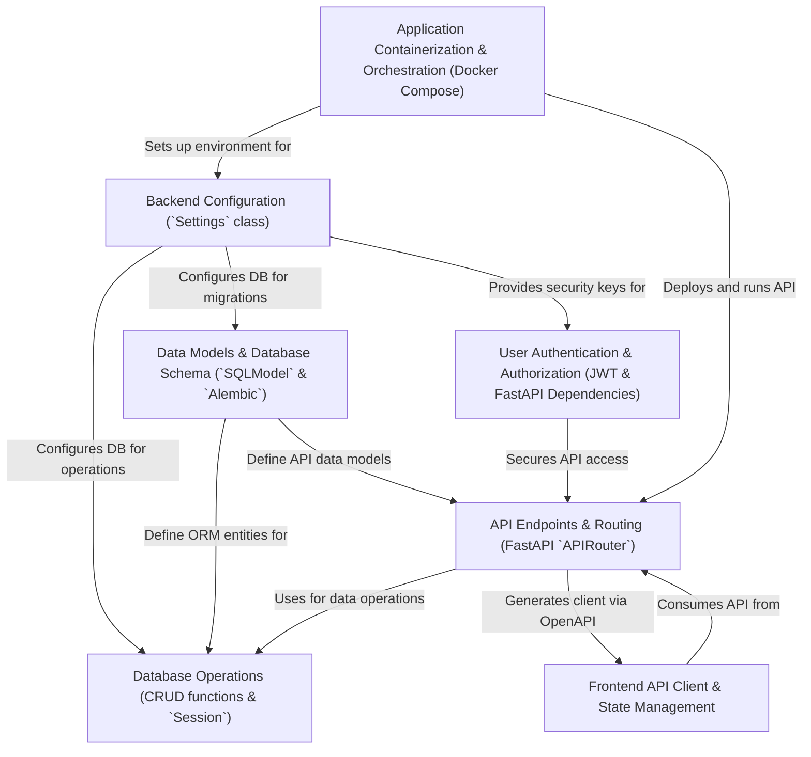

# Tutorial: full-stack-fastapi-template

This project is a **full-stack template** for building modern web applications.
It provides a *FastAPI backend* to create APIs, a *React/Vite frontend* for the
user interface, and a *PostgreSQL database* for storing data.
Key features include **user accounts**, example *data management* (like items),
and the whole application is managed with **Docker** for easy setup and
deployment.

**Source Repository:**
[https://github.com/fastapi/full-stack-fastapi-template](https://github.com/fastapi/full-stack-fastapi-template)

## Chapters

1. [Application Containerization & Orchestration (Docker Compose) ](01_application_containerization___orchestration__docker_compose__.md)
2. [Frontend API Client & State Management ](02_frontend_api_client___state_management_.md)
3. [Data Models & Database Schema (`SQLModel` & `Alembic`) ](03_data_models___database_schema___sqlmodel_____alembic___.md)
4. [API Endpoints & Routing (FastAPI `APIRouter`) ](04_api_endpoints___routing__fastapi__apirouter___.md)
5. [Database Operations (CRUD functions & `Session`) ](05_database_operations__crud_functions____session___.md)
6. [User Authentication & Authorization (JWT & FastAPI Dependencies) ](06_user_authentication___authorization__jwt___fastapi_dependencies__.md)
7. [Backend Configuration (`Settings` class) ](07_backend_configuration___settings__class__.md)

---

Generated by
[AI Codebase Knowledge Builder](https://github.com/The-Pocket/Tutorial-Codebase-Knowledge)
